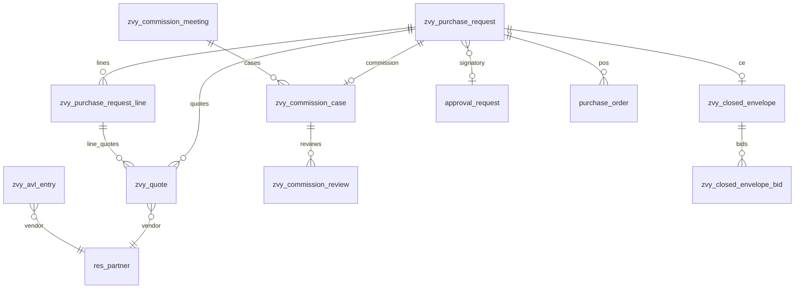
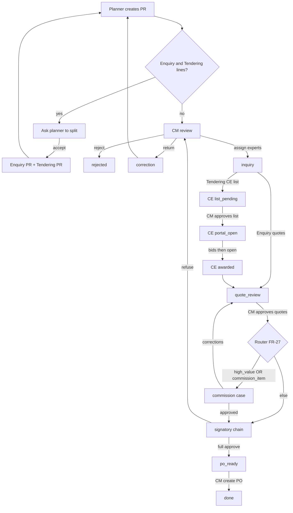

# zvy_tendering — Architecture & Design

**Product:** Mammut Procurement & Tendering  
**Platform:** Odoo 18 (standalone addon `zvy_tendering`)  
**Related:** [README.md](README.md) (PRD) · [Roadmap.md](Roadmap.md) (phasing)

This document is the implementation design for the requirements in the PRD. Locked assumptions (PRD §10): standalone `zvy.purchase.request`, hybrid `approval.request` for Stories 12–14 only, in-Odoo AVL, portal UI after backend, final PO = standard `purchase.order`.

---

## 1. Module shell

### 1.1 Manifest

| Key | Value |
|-----|--------|
| Technical name | `zvy_tendering` |
| Version | `18.0.1.8.0` |
| Depends | `mail`, `product`, `purchase`, `approvals`, `portal` |
| Optional later | `approval_ext`, `mammut_refuse_reason` (reuse refuse/return UX if installed) |

`portal` is declared from day one so CE invitation/partner links and Phase 5 controllers share one module. Portal **UI** ships in Roadmap Phase 5; until then Commission Manager may enter sealed bids manually (FR-29).

### 1.2 Suggested tree

```text
zvy_tendering/
├── __init__.py
├── __manifest__.py
├── models/
│   ├── __init__.py
│   ├── zvy_purchase_request.py
│   ├── zvy_purchase_request_line.py
│   ├── zvy_quote.py
│   ├── zvy_avl.py
│   ├── zvy_commission_case.py
│   ├── zvy_commission_review.py
│   ├── zvy_commission_meeting.py
│   ├── zvy_closed_envelope.py
│   ├── zvy_closed_envelope_bid.py
│   ├── product_template.py          # enquiry/tendering + commission
│   ├── res_company.py
│   ├── res_config_settings.py
│   ├── approval_request.py          # bridge hooks (refuse → CM, approve → po_ready)
│   └── purchase_order.py            # zvy_purchase_request_id traceability
├── wizard/
│   ├── request_reject_wizard.py
│   ├── request_return_wizard.py
│   ├── request_assign_wizard.py
│   ├── request_quote_reject_wizard.py
│   ├── request_quote_shortfall_wizard.py  # <3 quotes justification (FR-10)
│   ├── request_split_wizard.py      # mixed enquiry/tendering (FR-31)
│   └── ce_clarification_wizard.py
├── security/
│   ├── security.xml                 # category, groups, record rules
│   └── ir.model.access.csv
├── data/
│   ├── ir_sequence_data.xml
│   └── mail_template_data.xml
├── views/
│   ├── menus.xml
│   ├── zvy_purchase_request_views.xml
│   ├── ...
│   └── res_config_settings_views.xml
├── controllers/
│   └── portal.py                    # /my/tenders (Phase 5)
└── tests/
    ├── common.py
    ├── test_quote_minima.py
    ├── test_avl_domain.py
    ├── test_router.py
    ├── test_signatory_bridge.py
    ├── test_bid_seal.py
    ├── test_portal_isolation.py
    └── test_product_split.py
```

### 1.3 Data load order

Mirror [artarad_payment_request_base](../artarad_payment_request_base/__manifest__.py):

1. `security/security.xml`
2. `security/ir.model.access.csv`
3. `data/*`
4. views
5. menus

---

## 2. Domain model

### 2.1 Entity overview



### 2.2 Models

#### `zvy.purchase.request`

PR header. Inherits `mail.thread`, `mail.activity.mixin`.

| Field | Type | Notes |
|-------|------|--------|
| `name` | Char | Sequence (e.g. `PR/2026/00001`), readonly after create |
| `company_id` | Many2one `res.company` | Required; multi-company |
| `requester_id` | Many2one `res.users` | Planner; default `env.user` |
| `description` | Text | Header description |
| `line_ids` | One2many | → `zvy.purchase.request.line` |
| `state` | Selection | See §3.1 |
| `currency_id` | Many2one | Company currency (or explicit) |
| `amount_total` | Monetary | Computed from lines (estimate or awarded) |
| `is_high_value` | Boolean | Computed: total ≥ company threshold (BR-3) |
| `is_commission_item` | Boolean | Computed: any Enquiry line with product **Need Commission** (BR-4) |
| `procurement_type` | Selection | Computed: `enquiry` / `tendering` when all lines match; empty if mixed |
| `is_mixed_procurement` | Boolean | Computed: both Enquiry and Tendering lines present |
| `split_from_id` / `split_request_id` | Many2one | Sibling PRs after FR-31 split |
| `has_sole_source` | Boolean | Computed: any line `sole_source` |
| `commission_case_id` | Many2one | → `zvy.commission.case` |
| `closed_envelope_id` | Many2one | → `zvy.closed.envelope` (when CE path) |
| `approval_request_id` | Many2one | → `approval.request` (signatory bridge) |
| `purchase_order_ids` | One2many / Many2many | Created POs |
| `reject_reason` / `return_reason` | Text | Mandatory on reject/return |
| `award_partner_id` | Many2one | Winning vendor when single award |
| `quote_ids` | One2many | → `zvy.quote` (aggregation; not shown as a PR notebook tab) |

Key actions: `action_submit`, `action_split_mixed`, `action_reject`, `action_return_correction`, `action_assign_experts`, `action_approve_quotes`, `action_reject_quotes`, `_action_route_after_quotes`, `action_create_po`.

`action_submit` blocks mixed Enquiry+Tendering PRs (FR-31). UI (`zvy_ui_submit` context) opens `zvy.request.split.wizard`; RPC raises `ValidationError` and callers must invoke `action_split_mixed` then submit each PR. Split keeps Enquiry lines on the original sequence and moves Tendering lines to a new draft PR; neither is auto-submitted.

**Quote submission (FR-10) is per line, Enquiry PRs only.** `zvy.purchase.request.line.action_submit_quotes` is the primary entry point (button on My Assignments list + line form): it checks minima for those lines, flips their draft quotes to `submitted`, and calls `zvy.purchase.request._try_advance_to_quote_review`, which moves the PR to `quote_review` only when **every** line reports `quotes_submitted` (or a CE award already satisfies inquiry). Standard lines require ≥3 quotes **or** ≥1 quote plus `quote_shortfall_reason`; sole source requires ≥1. UI submit (`zvy_ui_submit`) with 1–2 quotes and no reason opens `zvy.request.quote.shortfall.wizard`; RPC raises `ValidationError`. The request-level `action_submit_quotes` is a convenience wrapper that submits just the caller’s own assigned lines. Only assigned Commercial Experts (and Admin) may submit — **not** the CM, who reviews the result. Tendering PRs collect a closed-envelope list instead of quotes.

Anything that aggregates across all lines (`_user_is_assigned_expert`, `_check_quote_minima`, `_try_advance_to_quote_review`) must read lines with `sudo`: experts can only read the lines assigned to them, so a plain `self.line_ids` raises `AccessError` on split-assignment PRs.

#### `zvy.purchase.request.line`

| Field | Type | Notes |
|-------|------|--------|
| `request_id` | Many2one | Parent PR |
| `request_state` | Selection (related) | `request_id.state`; drives form/list `readonly` attrs |
| `product_id` | Many2one `product.product` | |
| `procurement_type` | Selection (related) | Product `zvy_procurement_type` |
| `product_uom_qty` | Float | |
| `product_uom_id` | Many2one `uom.uom` | |
| `price_estimate` | Monetary | Planner estimate |
| `sole_source` | Boolean | Forces ≥1 quote; CEO in chain (FR-14) |
| `is_commission_item` | Boolean | Enquiry product **Need Commission**; computed, not planner-editable |
| `expert_user_ids` | Many2many `res.users` | Assigned Commercial Experts (FR-5); set via Assign Experts wizard |
| `quote_ids` | One2many | → `zvy.quote`; collected on the line form (My Assignments) |
| `quote_count` | Integer (compute) | Number of quotes on the line |
| `quotes_submitted` | Boolean (compute, stored) | True once the line’s live quotes all left `draft`; drives PR advancement |
| `quote_shortfall_reason` | Text | Required to submit 1–2 quotes on a non-sole-source line; set by the shortfall wizard |
| `awarded_quote_id` | Many2one `zvy.quote` | Selected quote for PO (CM sets in `quote_review`) |
| `awarded_partner_id` | Many2one | Related from awarded quote |

`action_view_quotes` (button on the PR Lines list and My Assignments) opens the standalone line form (`view_zvy_purchase_request_line_form`) — line details plus the Quotes notebook — the same view Commercial Experts see from My Assignments. Do not reuse the My Assignments window action (its domain is “assigned to me”). Line `display_name` is product + qty so remaining `line_id` fields (quote form) are readable.

**Editability:** content fields (product, qty, UoM, estimate, flags) may be written only when parent PR is `draft` or `correction` (`write` raises otherwise). `expert_user_ids` is CM/Admin-only on write. Views mirror this with `readonly="request_state not in ('draft', 'correction')"` on the standalone line form and `readonly` on the PR form’s `line_ids` when not intake-editable; `expert_user_ids` is UI-readonly (assignment only via wizard).

`quote_ids` and `line_ids` are **exempt** from the parent PR content lock: saving a quote or setting `awarded_quote_id` in a one2many issues a `write` on the parent while inquiry / quote review has the header locked. Editability is delegated to `zvy.quote._check_can_edit` and `zvy.purchase.request.line.write` (state + role), so the parent lock must not double-guard those one2manys.

#### `zvy.quote`

Expert-collected offer (standard inquiry path).

| Field | Type | Notes |
|-------|------|--------|
| `request_id` | Many2one | |
| `request_state` | Selection (related) | `request_id.state`; drives form `readonly` attrs |
| `line_id` | Many2one | Optional: quote per line |
| `allowed_partner_ids` | Many2many (compute) | AVL vendors for the line’s company/product/category |
| `partner_id` | Many2one | Domain: `[('id', 'in', allowed_partner_ids)]` (BR-1 / FR-9) |
| `price_unit` / `amount_total` | Monetary | |
| `currency_id` | Many2one | |
| `attachment_ids` | Many2many / binary | |
| `expert_user_id` | Many2one | Who recorded it; default `env.user`; readonly (system-set) |
| `state` | Selection | e.g. `draft`, `submitted`, `accepted`, `rejected`; readonly — advanced only by workflow actions (`sudo`) |

**Editability:** `_check_can_edit` allows create/write/unlink only while PR is `inquiry` (and, for non-CM/Admin, only on lines assigned to the user). Views grey out quote fields when `request_state != 'inquiry'` (standalone quote form and Quotes one2many on the line). `expert_user_id` and `state` are field- and view-readonly; create forces them to the current user / `draft`, and non-`sudo` writes to those keys raise — workflow actions (`Submit Quotes`, approve/reject) advance `state` via `sudo`.

#### `zvy.avl.entry`

Approved Vendor List maintained in Odoo (no external sync).

| Field | Type | Notes |
|-------|------|--------|
| `partner_id` | Many2one `res.partner` | Vendor |
| `company_id` | Many2one | |
| `product_id` | Many2one | Optional product scope |
| `categ_id` | Many2one `product.category` | Optional category scope |
| `active` | Boolean | Only active entries selectable |
| `date_start` / `date_end` | Date | Optional validity |

Domain helper: `_avl_partner_domain(company, product=None, categ=None)` used by quote and CE invite fields.

Computed fields that read `self.env.user` (`allowed_partner_ids`) must declare `depends_context=('uid', ...)`; without it the cache serves the first user’s value to everyone in the same transaction.

Vendor pickers must never be filtered by an `onchange`-returned domain (unsupported since Odoo 17 — it silently lists every contact). Each model exposes a non-stored computed `allowed_partner_ids` and the vendor field declares `domain="[('id', 'in', allowed_partner_ids)]"`: `zvy.quote` scopes by line company/product/category, `zvy.closed.envelope` by company. Views that let a vendor be picked must load the helper field (`invisible="1"` / `column_invisible="1"`). Server-side `_check_avl` / `_check_invite_avl` reuse the same helper so UI and validation cannot drift.

#### `zvy.commission.case`

| Field | Type | Notes |
|-------|------|--------|
| `request_id` | Many2one | Source PR |
| `name` | Char | Sequence or related PR name |
| `state` | Selection | e.g. `open`, `in_review`, `meeting`, `approved`, `rejected`, `corrections` |
| `reason_high_value` / `reason_commission_item` | Boolean | Why routed |
| `expert_user_ids` | Many2many | Assigned Commission Experts |
| `review_ids` | One2many | → `zvy.commission.review` |
| `meeting_id` | Many2one | Optional linked meeting |
| `manager_decision` | Selection | approve / reject / corrections |
| `manager_notes` | Text | |

#### `zvy.commission.review`

| Field | Type | Notes |
|-------|------|--------|
| `case_id` | Many2one | |
| `expert_user_id` | Many2one | |
| `recommendation` | Selection | `approve`, `reject`, `request_corrections` (FR-23) |
| `notes_accuracy` / `notes_policy` / `notes_suppliers` | Text | FR-22 |
| `state` | Selection | `draft`, `submitted` |

#### `zvy.commission.meeting`

| Field | Type | Notes |
|-------|------|--------|
| `name` | Char | |
| `datetime` | Datetime | |
| `case_ids` | Many2many | Aggregated cases (FR-18) |
| `mom_attachment_ids` | Many2many / binary | Minutes of meeting |

#### `zvy.closed.envelope`

Closed-envelope tender linked to a PR (or line set).

| Field | Type | Notes |
|-------|------|--------|
| `request_id` | Many2one | |
| `state` | Selection | See §3.2 |
| `invite_partner_ids` | Many2many | AVL-only; domain `[('id', 'in', allowed_partner_ids)]` + `_check_invite_avl` |
| `opening_datetime` | Datetime | Required on list approval (FR-20) |
| `bid_deadline` | Datetime | Required on list approval; default window from settings |
| `bid_ids` | One2many | → `zvy.closed.envelope.bid` |
| `winner_partner_id` | Many2one | Set after open (FR-19) |

#### `zvy.closed.envelope.bid`

| Field | Type | Notes |
|-------|------|--------|
| `envelope_id` | Many2one | |
| `partner_id` | Many2one | Invited supplier |
| `amount` | Monetary | **Sealed** until open (FR-30) |
| `currency_id` | Many2one | |
| `notes` | Text | |
| `attachment_ids` | Many2many | Sealed with amount |
| `submitted_at` | Datetime | |
| `source` | Selection | `portal` / `manual` |

Sealing: override `read` / use computed “visible” fields so non-authorized users get empty/hidden amounts before `action_open_bids`. Portal user always reads **own** bid.

#### Extensions

| Model | Additions |
|-------|-----------|
| `res.company` | `zvy_high_value_threshold` (Monetary), `zvy_default_bid_window_hours` (Integer), `zvy_signatory_approval_category_id` (Many2one `approval.category`), `zvy_sole_source_approver_ids` (Many2many `res.users`) |
| `res.config.settings` | Related fields for settings UI |
| `product.template` | `zvy_procurement_type` (`enquiry` default / `tendering`); `zvy_need_commission` (default False; visible only when Enquiry) |
| `approval.request` | `zvy_purchase_request_id`; on refuse → PR `cm_review`; on full approve → PR `po_ready` |
| `purchase.order` | Optional `zvy_purchase_request_id` for traceability |

---

## 3. State machines

### 3.1 Purchase request states

| State | Meaning |
|-------|---------|
| `draft` | Planner editing |
| `submitted` | In CM queue |
| `cm_review` | CM reviewing (also re-entry after signatory refuse / quote reject) |
| `inquiry` | Experts collecting quotes / CE list |
| `quote_review` | CM reviewing quote set |
| `commission` | Holding commission case open |
| `signatory` | Sequential company approvals in progress |
| `po_ready` | All approvals done; CM may create PO |
| `done` | PO(s) created |
| `correction` | Returned to planner |
| `rejected` | Terminal reject (BR-9) |

Canonical happy path:

```text
draft → submitted → cm_review → inquiry → quote_review
  → (route) commission | signatory
  → po_ready → done
```

Branches:

- CM reject → `rejected`
- CM return → `correction` → (resubmit) `submitted`
- CM reject quotes → `inquiry`
- Signatory refuse → `cm_review` (BR-8)
- Commission corrections → company quote review (`quote_review` / `inquiry`) as designed

### 3.2 Closed-envelope states

| State | Meaning |
|-------|---------|
| `draft` | Expert building invite list |
| `list_pending` | Awaiting Commission Manager (FR-11) |
| `portal_open` | List approved; bidding open (FR-29) |
| `opened` | Bids unsealed (`action_open_bids`) |
| `awarded` | Winner selected (FR-19) |
| `cancelled` | Cancelled |

### 3.3 End-to-end flow



Sole source: after commission (if any), signatory category always includes CEO before `po_ready` (FR-14).

---

## 4. Routing & business rules

### 4.1 Rule → implementation map

| ID | Rule | Enforcement |
|----|------|-------------|
| BR-1 | AVL-only vendors | Domain on `zvy.quote.partner_id` and CE invites; `_check_avl` on write/submit |
| BR-2 | ≥3 quotes, or ≥1 with `quote_shortfall_reason`; ≥1 sole source | `zvy.purchase.request.line._check_quote_minima` before expert submit (FR-10) |
| BR-3 | Configurable high-value threshold | `company_id.zvy_high_value_threshold`; `_compute_is_high_value` |
| BR-4 | Commission items → Holding | Enquiry product `zvy_need_commission`; line/header flags computed |
| BR-5 | Sole source → CEO in chain | When spawning `approval.request`, ensure CEO/sole-source approvers in sequence |
| BR-6 | PO only from `po_ready` by CM | `action_create_po` groups + state guard + award data required |
| BR-7 | Seal bids until open | Record rules + field read masking on `zvy.closed.envelope.bid` |
| BR-8 | Signatory refuse → CM | `approval.request` refuse hook → PR `cm_review` |
| BR-9 | Reject terminal; correction editable | State machine + planner write rules |
| BR-10 | Homogeneous procurement type | Mixed Enquiry+Tendering PRs cannot submit; FR-31 split |

### 4.2 System FR methods

| FR | Behavior |
|----|----------|
| FR-27 | `_action_route_after_quotes`: if `is_commission_item or is_high_value` → create/open `zvy.commission.case`, state `commission`; else → `_action_spawn_signatory_approval`, state `signatory`. `is_commission_item` comes from Enquiry product **Need Commission** (Tendering products never set it; high-value still applies). |
| FR-28 | Block `po_ready` while linked `approval.request` not approved; no bypass for unauthorized roles |
| FR-29 | CE `action_approve_list` (requires `opening_datetime`, `bid_deadline`) → state `portal_open`; notify invited partners when portal live |
| FR-30 | Before open: only Commission Manager (and seal roles) + bidder’s own portal view can read bid amounts/attachments; after `action_open_bids`, authorized roles see all |
| FR-31 | Mixed Enquiry+Tendering: UI submit opens split wizard; RPC raises. `action_split_mixed` keeps Enquiry lines, moves Tendering lines to a new draft PR. |

---

## 5. Security

### 5.1 Groups

Category: **Procurement & Tendering** (`ir.module.category`).

| XML id (suggested) | Label | Persona |
|--------------------|-------|---------|
| `group_zvy_planner` | Planner | Create/submit own PRs; edit in `draft`/`correction` |
| `group_zvy_commercial_manager` | Commercial Manager | CM queues, assign, quote review, create PO |
| `group_zvy_commercial_expert` | Commercial Expert | Inquiry on assigned lines |
| `group_zvy_signatory` | Signatory | Read-only PR context from Approvals when user is an approver |
| `group_zvy_commission_manager` | Commission Manager | Cases, meetings, CE list/open/award |
| `group_zvy_commission_expert` | Commission Expert | Assigned case reviews |
| `group_zvy_tendering_admin` | Administrator | Config, AVL admin, all records |

Each role uses its own child `ir.module.category` under **Procurement & Tendering** so Access Rights shows them without debug mode (sibling groups in one category become boolean fields and are debug-only).

`group_zvy_signatory` implies only `base.group_user` (not Approvals Officer/Admin). Standard employees already approve requests they are assigned to via Approvals record rules. Assign Signatory to company approvers (Finance, CEO, etc.); they must also be listed on the Signatory Approval Category (or sole-source approvers). No Tendering menus — they open PR detail from the linked Approval Request. Portal suppliers use `base.group_portal` linked to `res.partner`.

Implied hierarchy (example): Admin implies CM + Signatory + Commission Manager + Expert groups as needed for support.

### 5.2 Record rules (intent)

| Scope | Domain intent |
|-------|----------------|
| Multi-company | `company_id in company_ids` (or False) on all company-scoped models |
| Planner | Own PRs (`requester_id = user`) |
| Commercial Expert | Lines where `user in expert_user_ids`; may add/edit quotes in `inquiry` only, **from the line** (no PR write ACL); product/qty/expert fields UI- and write-locked outside `draft`/`correction` (FR-8) |
| Commercial Manager | All company PRs |
| Signatory | PRs (and lines/quotes/linked commission case & CE) where `user` is on `approval_request_id.approver_ids`; **read-only** (no write/create/unlink). Also read-only AVL (form computes sole_source / quote allowed vendors). |
| Commission Expert | Cases where `user in expert_user_ids` |
| Commission Manager | All open commission cases / CE for company |
| Sealed bids | Until CE `opened`/`awarded`: amount/attachments readable only by Commission Manager (and admin); portal: `partner_id = user.partner_id` |
| Portal invitations | CE visible only if partner in `invite_partner_ids` |

ACL CSV: CRUD matrix per model × group (experts create quotes; planners create PRs; CM create PO via action; signatories read-only PR context; suppliers no backend model write except portal controllers using `sudo` with checks).

---

## 6. Integrations

### 6.1 Approvals (hybrid — Stories 12–14 only)

- PR remains `zvy.purchase.request`; never replace with `approval.request` or `purchase.requisition` (PRD non-goals).
- `_action_spawn_signatory_approval`: create sequential `approval.request` from `company.zvy_signatory_approval_category_id`, link via `zvy_purchase_request_id` / `approval_request_id`.
- Sole source: ensure `company.zvy_sole_source_approver_ids` (e.g. CEO) are required last-sequence approvers before completion.
- Approve chain complete → PR `po_ready`.
- Refuse → PR `cm_review` with reason (BR-8); optionally mirror [mammut_refuse_reason](../mammut_refuse_reason) UX.
- FR-28: no transition to `po_ready` while approval pending.

### 6.2 Purchase Order

- Only Commercial Manager; only when `state == 'po_ready'` and award data present (awarded quotes / CE winner).
- Create one or more `purchase.order` (+ lines) from awarded vendors/lines; set `zvy_purchase_request_id`; PR → `done`.

### 6.3 Supplier portal (Phase 5)

- Controllers under `/my/tenders` (list + detail + bid form).
- Access: portal user partner ∈ CE `invite_partner_ids` and CE in `portal_open` (or post-open read-only results).
- Submit/update/withdraw bid before `bid_deadline` and before official opening; store `zvy.closed.envelope.bid` with `source=portal`.
- Until Phase 5: Commission Manager manual bid entry (`source=manual`) still honored by seal rules.

### 6.4 Web service (FR-1)

- External systems create/submit via XML-RPC / JSON-RPC on `zvy.purchase.request` (`create` + `action_submit`).
- Documented field set: header (company, requester, description) + lines (product, qty, UoM, estimate). Mixed Enquiry+Tendering `action_submit` raises; call `action_split_mixed` first.
- ACL: dedicated integration user with Planner (or API) rights.

### 6.5 Notifications

| Event | Channel |
|-------|---------|
| Reject / return / terminal outcomes | Mail + activity to planner (FR-2) |
| Expert / commission assignment | Activity on assignee |
| Signatory pending | Approvals module notifications |
| Portal open / clarification / result | Mail (+ portal note) — Phase 5 (FR-26) |

All status changes, reasons, assignments, awards tracked on chatter (`mail.thread`).

---

## 7. Configuration

| Setting | Storage | Used by |
|---------|---------|---------|
| High-value threshold | `res.company.zvy_high_value_threshold` | FR-27 / BR-3 |
| Default bid window (hours) | `res.company.zvy_default_bid_window_hours` | Suggests `bid_deadline` on CE open |
| Signatory approval category | `res.company.zvy_signatory_approval_category_id` | FR-12..14 |
| Sole-source approvers (CEO) | `res.company.zvy_sole_source_approver_ids` | FR-14 / BR-5 |
| Commission on Enquiry product | `product.template.zvy_need_commission` | BR-4 |
| Product procurement type | `product.template.zvy_procurement_type` | FR-1 / FR-10 / FR-11 / FR-31 |
| Commission / sole source on line | Line flags (computed) | BR-4 / BR-5 |
| PR sequence | `ir.sequence` | FR-1 |

Expose via `res.config.settings` under a Tendering settings block.

---

## 8. Testing strategy

Automated tests (PRD §7) mapped to design:

| Area | Assert |
|------|--------|
| Quote minima | Standard line blocks submit with &lt;3 quotes unless `quote_shortfall_reason` is set (still ≥1); sole source allows 1 |
| AVL domain | Non-AVL partner cannot be set on quote / CE invite; `allowed_partner_ids` excludes non-AVL and other-company vendors |
| Quote collection | Expert saves a quote via `line.write({'quote_ids': ...})` in `inquiry`; other line content still blocked; `action_view_quotes` opens the line form (details + quotes) |
| Expert line lock | Content edits on lines blocked outside `draft`/`correction`; views use `request_state` readonly |
| Router | High value / Enquiry commission → case; else → approval.request |
| Mixed PR split | Mixed submit blocked; split keeps Enquiry, new PR gets Tendering |
| Signatory bridge | Refuse → `cm_review`; approve → `po_ready`; sole source includes CEO |
| Bid seal | Non-manager cannot read amount before open; bidder can read own |
| Portal isolation | Non-invited portal user gets empty/403 |

---

## 9. Traceability

| Design area | PRD |
|-------------|-----|
| Models §2 | FR-1, FR-9, FR-11, FR-15–23, FR-24–25, FR-31 |
| States §3 | §4 process; FR-4, FR-7, FR-20, FR-29 |
| Routing §4 | FR-27–30; BR-1–9 |
| Security §5 | Personas §2; NFR Security |
| Integrations §6 | FR-7, FR-12–14, FR-24–26, FR-1 API |
| Config §7 | PRD §8 |
| Delivery order | [Roadmap.md](Roadmap.md) Phases 0–5 |
