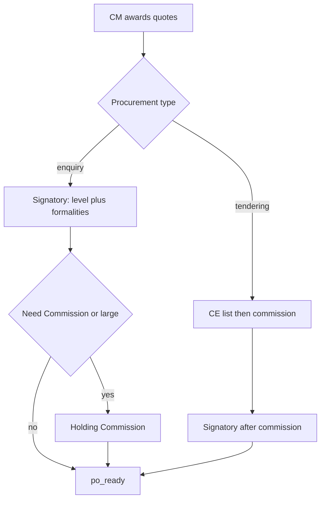

# zvy_tendering — Implementation Roadmap

**Product:** Mammut Procurement & Tendering  
**Related:** [README.md](README.md) (PRD) · [Architecture.md](Architecture.md) (design)

Phasing follows PRD §10: backend Stories **1–23** and **27–30** first; supplier portal Stories **24–26** last. Each phase lists stories/FRs, checklists, suggested tests, and exit criteria. Dependency order: foundation → PR/CM intake → inquiry & routing → commission & CE seal → sign-off & PO → portal UI → customer PRD 1.3 series (purchase level, routing invert, inquiry fields, partial PO, per-item bids, meetings, pre-checks, company override, return path, holding-scoped commission).

---

## Phase overview

| Phase | Focus | Stories / FRs | Depends on |
|-------|--------|---------------|------------|
| **0 — Foundation** | Module shell, groups, settings, sequences, AVL | Config §8; foundation for FR-9 | — |
| **1 — PR & CM intake** | PR lifecycle, CM queues, reject/return, planner notify | 1–4 (FR-1..4) | 0 |
| **2 — Inquiry & routing** | Assign experts, AVL quotes, minima, CM quote review, auto-route | 5–6, 8–10, 27 | 1 |
| **3 — Holding Commission** | Cases, reviews, meetings, CE list/seal/open/award (manual bids) | 11, 15–23, 29–30 | 2 |
| **4 — Sign-off & PO** | Sequential Approvals, CEO sole source, create PO | 7, 12–14, 28 | 2 (and 3 if commission path) |
| **5 — Supplier portal** | `/my/tenders`, sealed submit, notifications | 24–26 | 3 |
| **6 — Purchase level & formalities** | `MINOR/MEDIUM/MAJOR/LARGE`, valid-inquiry rules, تشریفات, signature reset | FR-32..34 | 4 |
| **7 — Inquiry routing invert** | Signatures before commission on inquiry; tender still commission-first | FR-35 (replaces FR-27 inquiry path) | 6 |
| **8 — Inquiry fields & validity** | Rich quote fields, unpriced quotes, last-purchase on lines | FR-36..37 | 2 |
| **9 — Partial PO** | 1 PR → N POs; pending lines; CM/Commission Manager split | FR-38 (extends FR-7) | 4, 7 |
| **10 — Per-item bids** | Bid lines, discount, per-item award / re-tender | FR-39..41 | 5 |
| **11 — Meetings** | Same-company PRs, attendees, per-PR decisions, transfer | FR-42 (extends FR-18) | 3, 7 |
| **12 — Commission pre-checks** | US-06 validation report; SAP checks stubbed | FR-43 | 7, 8, 11 |
| **13 — Company procurement override** | Group default + per-company type / Need Commission | FR-44 | 6 |
| **14 — Return to last approver** | Correction destination; CM chooses planner vs expert | FR-45 | 7 |
| **15 — Holding company commission** | Commission on head holding (`root_id`); multi-company record rules | FR-46 | 3, 13 |

**First delivery (MVP backend):** Phases 0–4 complete.  
**Second delivery:** Phase 5.  
**Third delivery (customer PRD 1.3):** Phases 6–15. Source: customer **PRD — Purchase Request System v1.3** (post-pilot). Does **not** reopen Phases 0–5. Version series **`18.0.2.x`** (breaking: inquiry routing order and partial PO). New FRs start at **FR-32**. Specs for 6–15 land in [README.md](README.md) / [Architecture.md](Architecture.md) **when each phase is implemented**; until then this roadmap is the backlog.

Purchase-level bands are the R-PL-012/013/014 matrix (company scale × operational/non-operational) with optional per-company overrides. Signatory users are per-band lists on the company.

---

## Phase 0 — Foundation

**Goal:** Installable addon with security, config, and AVL so later phases have somewhere to hang data.

### Scope

- [x] `__manifest__.py` with depends: `mail`, `product`, `purchase`, `approvals`, `portal`
- [x] Module category + groups (Planner, CM, CCE, Signatory, Commission Manager/Expert, Admin) — [Architecture.md](Architecture.md) §5
- [x] ACL CSV stubs for models introduced in later phases (or create models empty and ACL as they land)
- [x] Multi-company record-rule pattern
- [x] Menus shell (Procurement & Tendering)
- [x] `res.company` / `res.config.settings`: high-value threshold, default bid window, signatory approval category
- [x] `product.template.zvy_procurement_type` / `zvy_need_commission` (replaces former `product.category.zvy_is_commission_item`)
- [x] `ir.sequence` for PR (and CE/case if needed)
- [x] `zvy.avl.entry` CRUD + views (active vendor by company / product / category)

### Stories / FRs

| Item | Notes |
|------|--------|
| PRD §8 Configuration | All product-facing settings editable |
| FR-9 foundation | AVL model exists for Phase 2 domains |

### Suggested tests

- [x] Settings write/read on company
- [x] AVL `active` filter; multi-company isolation

### Done when

Module installs cleanly; Admin can maintain AVL and thresholds; role groups assignable to users.

---

## Phase 1 — PR & CM intake

**Goal:** Planner creates/submits PRs; CM sees queues and can reject or return; planner notified and can correct.

### Scope

- [x] Models: `zvy.purchase.request`, `zvy.purchase.request.line`
- [x] States: `draft`, `submitted`, `cm_review`, `correction`, `rejected` (other states stubbed or blocked until later)
- [x] Actions: submit, reject (mandatory reason), return for correction (mandatory reason)
- [x] Sequence number on create (FR-1)
- [x] CM dashboard / list filters for new & awaiting review
- [x] Planner notifications (mail/activity) on reject, return, and relevant terminal outcomes (FR-2)
- [x] Chatter logging for reject/return
- [x] Web service: create + `action_submit` via RPC (FR-1)
- [x] Record rules: planner own PRs; CM all company PRs

### Stories / FRs checklist

- [x] **Story 1 / FR-1** — Create PR (UI + web service); unique sequence; draft → submitted
- [x] **Story 2 / FR-2** — Notify planner on reject / return / outcomes; edit & resubmit from `correction`
- [x] **Story 3 / FR-3** — CM dashboard of new / awaiting review PRs
- [x] **Story 4 / FR-4** — Reject (terminal) or return with mandatory reason; logged

### Suggested tests

- [x] Submit moves to CM queue
- [x] Reject requires reason → `rejected`
- [x] Return → `correction`; planner can resubmit
- [x] RPC create/submit with ACL user

### Done when

Acceptance criteria for FR-1..4 are met; planner and CM can run the intake loop without inquiry yet.

---

## Phase 2 — Inquiry & routing

**Goal:** CM assigns lines to experts; experts collect AVL-only quotes with minima; CM approves/rejects quote set; system routes to commission vs signatory (signatory spawn can stub until Phase 4).

### Scope

- [x] Line `expert_user_ids`; assign wizard/action (FR-5); PR → `inquiry`
- [x] Expert dashboard: only assigned lines (FR-8)
- [x] Assigned-line / quote forms: product/qty/expert (and quote fields outside inquiry) UI-readonly via `request_state` — no edit-then-error UX
- [x] `zvy.quote` with AVL domain (FR-9 / BR-1) — vendor picker filtered by computed `allowed_partner_ids`, not an onchange domain
- [x] Quote minima: ≥3 standard, or ≥1 with a shortfall reason; ≥1 sole source before submit (FR-10 / BR-2)
- [x] Expert submit → `quote_review`
- [x] Per-line submit by the assigned expert; PR advances to `quote_review` only when all lines are submitted (CM cannot submit)
- [x] CM approve quotes → `_action_route_after_quotes` (FR-27); CM reject quotes → back to `inquiry` with reason (FR-6)
- [x] Compute `is_high_value`, `is_commission_item`, `has_sole_source`
- [x] On route to commission: create `zvy.commission.case` shell (full UX in Phase 3) **or** set state `commission` ready for Phase 3
- [x] On route to company path: set state `signatory` placeholder / spawn Approvals in Phase 4

### Stories / FRs checklist

- [x] **Story 5 / FR-5** — Assign lines to one or more Commercial Experts
- [x] **Story 6 / FR-6** — CM review quotes; approve → routing; reject → inquiry
- [x] **Story 8 / FR-8** — Expert sees only assigned items
- [x] **Story 9 / FR-9** — AVL-only supplier selection
- [x] **Story 10 / FR-10** — Quote minima and submit to CM
- [x] **Story 27 / FR-27** — Auto-route by high value / commission item vs company path

### Suggested tests

- [x] Expert cannot edit unassigned lines
- [x] Assigned line product/qty locked outside draft/correction (server + view readonly)
- [x] Non-AVL partner rejected on quote
- [x] Quote vendor dropdown lists only AVL vendors for the line’s company/product
- [x] Expert saves a quote from the line one2many while the PR is in inquiry (parent content lock exempts `quote_ids`)
- [x] Minima block/allow submit
- [x] Split assignment: each expert submits their own line; PR advances only when all lines are in (no cross-line `AccessError`)
- [x] Router: below threshold, no commission → company path; high value or commission flag → commission case

### Done when

FR-5, 6, 8–10, 27 pass; quote-approved PRs land on the correct path (commission or signatory stub).

---

## Phase 3 — Holding Commission & closed envelope

**Goal:** Holding reviews high-value/commission cases; CE supplier list approval opens bidding; bids sealed until open; award winner. Manual sealed bid entry until Phase 5.

### Scope

#### Commission

- [x] `zvy.commission.case` dashboard (FR-15)
- [x] Assign Commission Experts (FR-16)
- [x] `zvy.commission.review`: accuracy / policy / suppliers notes; recommendation approve / reject / corrections (FR-21–23)
- [x] Approve without meeting when all experts approve (FR-17) → advance toward signatory
- [x] `zvy.commission.meeting`: link cases, datetime, MOM upload; record outcomes (FR-18)
- [x] Corrections path returns work to company quote review as designed

#### Closed envelope

- [x] `zvy.closed.envelope` + invite AVL partners (FR-11)
- [x] Submit list → `list_pending`
- [x] Commission Manager approve/reject list; require `opening_datetime` + `bid_deadline` (FR-20)
- [x] Approve → `portal_open` (FR-29); default bid window from settings
- [x] `zvy.closed.envelope.bid` with seal rules (FR-30); manual entry by Commission Manager
- [x] `action_open_bids` after opening; select winner (FR-19); store award for PO
- [x] Optional notify stubs for results (full mail in Phase 5)

### Stories / FRs checklist

- [x] **Story 11 / FR-11** — CE supplier list by expert
- [x] **Story 15 / FR-15** — Commission Manager dashboard
- [x] **Story 16 / FR-16** — Assign Commission Experts
- [x] **Story 17 / FR-17** — Approve without meeting
- [x] **Story 18 / FR-18** — Meetings + MOM
- [x] **Story 19 / FR-19** — Select CE winner after open
- [x] **Story 20 / FR-20** — Approve CE supplier list
- [x] **Story 21 / FR-21** — Expert receives assignments
- [x] **Story 22 / FR-22** — Verify quotes / policy / AVL
- [x] **Story 23 / FR-23** — Submit audit report
- [x] **Story 29 / FR-29** — Auto `portal_open` on list approval
- [x] **Story 30 / FR-30** — Seal bids until opening

### Suggested tests

- [x] Bid amounts hidden from non-manager before open
- [x] Bidder (portal user later; sudo partner check now) can read own bid
- [x] List approval without deadlines fails
- [x] Winner selection blocked before open
- [x] Commission approve-without-meeting when all reviews approve

### Done when

FR-11, 15–23, 29–30 pass with **manual** bids; sealed integrity holds; approved commission cases ready for Phase 4 sign-off.

---

## Phase 4 — Sign-off & Purchase Order

**Goal:** Sequential company signatories via Approvals; CEO on sole source; refuse returns to CM; CM creates standard POs from `po_ready`.

### Scope

- [x] Spawn sequential `approval.request` from company signatory category (FR-12)
- [x] Link PR ↔ approval; PR context from approval form via Signatory role (approver-only, read-only) (FR-13)
- [x] Full approval → `po_ready`; refuse → `cm_review` with reason (BR-8)
- [x] Sole source always includes CEO / sole-source approvers in chain, including after commission (FR-14)
- [x] Enforce no `po_ready` while approval pending (FR-28)
- [x] After commission approval, enter same signatory path
- [x] `action_create_po`: CM only, `po_ready` + award data → one or more `purchase.order`; PR → `done` (FR-7 / BR-6)
- [x] Optional `purchase.order.zvy_purchase_request_id` for traceability

### Stories / FRs checklist

- [x] **Story 7 / FR-7** — Create PO after approvals
- [x] **Story 12 / FR-12** — Sequential signatory documents
- [x] **Story 13 / FR-13** — Approve or refuse → CM
- [x] **Story 14 / FR-14** — CEO on all sole source
- [x] **Story 28 / FR-28** — Sequential enforcement; no unauthorized bypass

### Suggested tests

- [x] Signatory bridge: approve → `po_ready`; refuse → `cm_review`
- [x] Sole-source PR includes CEO before `po_ready`
- [x] Cannot create PO from non-`po_ready` or without award
- [x] Non-CM cannot create PO
- [x] Signatory can read linked PR/lines/quotes; cannot write; non-approver Signatory cannot read

### Done when

FR-7, 12–14, 28 pass; end-to-end company path and commission→signatory→PO path work without portal.

**MVP backend complete** (Stories 1–23, 27–30).

---

## Phase 5 — Supplier portal

**Goal:** Invited vendors view tenders, submit sealed bids before deadline, and receive invitation/result/clarification notifications.

### Scope

- [x] Portal controllers: `/my/tenders` list + detail (FR-24)
- [x] Invitation isolation: non-invited → empty / 403
- [x] Bid submit/update/withdraw while `portal_open` and before `bid_deadline` (FR-25)
- [x] Reject submit after deadline or after open with clear error
- [x] Store as `zvy.closed.envelope.bid` (`source=portal`); seal rules unchanged (FR-30)
- [x] Mail (+ optional portal note): portal open / invitation; clarification; award / not awarded / cancelled (FR-26)
- [x] Published tender documents downloadable on detail page

### Stories / FRs checklist

- [x] **Story 24 / FR-24** — Portal view tenders / RFQs
- [x] **Story 25 / FR-25** — Submit sealed bids before deadline
- [x] **Story 26 / FR-26** — Results & clarification notifications

### Suggested tests

- [x] Portal isolation (invited vs not)
- [x] Bid seal: other suppliers never see amounts
- [x] Deadline and pre-open update rules
- [x] Notification triggers on open / result

### Done when

FR-24–26 pass; CE path usable end-to-end from invitation to award without relying on manual bid entry.

---

## Customer PRD 1.3 series (`18.0.2.x`)

Does not reopen Phases 0–5. Customer user-story IDs (US-03, US-05, US-06, US-09, US-11, US-T-06, US-T-07, §5.x, §12.x) refer to **PRD — Purchase Request System v1.3**.

---

## Phase 6 — Purchase level & formalities (`18.0.2.0`)

**Goal:** Replace the single high-value boolean with a four-band purchase level, define a **valid** inquiry, and put a PR into تشریفات (formalities) when any line has fewer than three valid inquiries. Signature chain follows level + formalities; an effective change resets the chain and keeps history.

**Hooks:** [`models/res_company.py`](models/res_company.py) (level bands; keep `zvy_high_value_threshold` until cutover); [`models/zvy_purchase_request.py`](models/zvy_purchase_request.py) `_compute_routing_flags`, `_action_spawn_signatory_approval`.

### Scope

- [x] `purchase_level` on `zvy.purchase.request`: `minor` / `medium` / `major` / `large` (computed from awarded / estimated total vs company bands)
- [x] Company settings: company scale × operational/non-operational baked-in IRR tables (R-PL-012/013/014) with optional custom ceilings
- [x] Valid inquiry (FR-33 foundation): priced and received date &lt; 30 days; unpriced quotes allowed later in Phase 8 but **never** count toward the 3
- [x] `is_formalities` when **any** line has fewer than 3 valid inquiries (whole PR, not per line)
- [x] Spawn signatory chain from purchase level + formalities (per-band user lists; sole-source CEO inject from FR-14 still applies)
- [x] Effective-change list resets the in-progress chain and keeps prior `approval.request` records in history: request price, supplier list, quantity, add/remove goods
- [x] `is_high_value` remains derived or deprecated in favor of `purchase_level` (no silent dual routing)

### Stories / FRs checklist

- [x] **FR-32** — Purchase level on PR (computed; R-PL-012/013/014 bands + company override) — US-05
- [x] **FR-33** — Valid inquiry = priced + received &lt; 30 days; unpriced excluded from the count of 3 — US-03 / §5.1
- [x] **FR-34** — Formalities when any line has &lt;3 valid inquiries; extra signatories; effective-change **resets** chain and keeps history — §5.7

### Suggested tests

- [x] Totals in each band compute `minor` / `medium` / `major` / `large`
- [x] Quote older than 30 days or with no price is not a valid inquiry
- [x] One line with 2 valid inquiries sets header `is_formalities`
- [x] Formalities PR injects extra placeholder approvers vs a standard same-band PR
- [x] Changing qty (or other effective field) while `signatory` archives the current approval and spawns a new chain
- [x] Prior approval remains readable (history); only the new chain can reach `po_ready`

### Done when

FR-32..34 pass with placeholder bands; existing company-path and sole-source tests still green after chain spawn uses level + formalities.

---

## Phase 7 — Inquiry routing invert (`18.0.2.1`)

**Goal:** On **inquiry** PRs, complete company signatures **before** Holding Commission. On **tender** PRs, keep commission / closed-envelope **before** signatures. Commission entry requires the prior signature chain to exist (US-06 check 9 lands fully in Phase 12).

**Hooks:** [`models/zvy_purchase_request.py`](models/zvy_purchase_request.py) `_action_route_after_quotes` / `_action_route_after_signatory`; commission approve must not spawn a second enquiry chain.

### Target flows

### Scope

- [x] Enquiry after quote award: always `_action_spawn_signatory_approval` (level + formalities from Phase 6)
- [x] After inquiry sign-off: if Need Commission **or** `purchase_level == large` → create/open `zvy.commission.case`, state `commission`; else → `po_ready`
- [x] Tendering: unchanged order (CE / commission first, then signatory) — FR-27 still describes this path
- [x] Commission **approve** on an inquiry case must **not** spawn a second signatory chain (signatures already done)
- [x] Commission **approve** on a tendering case still spawns signatory (Phase 4 behavior)
- [x] `is_high_value` must not by itself send enquiry PRs to commission before signatures

### Stories / FRs checklist

- [x] **FR-35** — Inquiry: award → signatory → commission only if Need Commission or large; else `po_ready`. Tender: CE/commission → then signatory — US-05 / US-06 / §4.1.4–4.1.5

### Suggested tests

- [x] Non-commission enquiry below `large` → signatory → `po_ready` (no case)
- [x] Need-commission enquiry → signatory first, then case
- [x] `large` enquiry without Need Commission → signatory first, then case
- [x] Tendering high-value / CE path still commission (or CE) before signatory
- [x] Inquiry commission approve does not create a new `approval.request`
- [x] Existing FR-27 tests updated to the inverted enquiry path

### Done when

FR-35 holds for enquiry and tendering; Phase 4 sign-off/PO tests updated; no enquiry PR enters `commission` with a missing or pending first signature chain.

---

## Phase 8 — Inquiry fields & validity (`18.0.2.2`)

**Goal:** Expand `zvy.quote` to the US-03 field set, allow unpriced inquiries with written details, and show last-purchase context on the PR line. Quote minima use **valid** inquiries (FR-33), not raw quote count.

**Hooks:** [`models/zvy_quote.py`](models/zvy_quote.py); [`models/zvy_purchase_request_line.py`](models/zvy_purchase_request_line.py) last-purchase + `_check_quote_minima`.

### Scope

- [x] Required quote fields: vendor, contact name, contact phone (from vendor master, editable), unit price (optional if unpriced), qty, total (auto when priced), inquiry datetime (system)
- [x] Optional: comments, delivery date, advance %, payment type, tolerance % (from last purchase, system), shipping, packaging type/count, contract ref, Nikan amount, price adjustment, warranty, proforma attachment, discount %
- [x] Unpriced quote: allowed with written details; `price_unit` not required; **does not** count toward 3 valid inquiries
- [x] Line `last_vendor_id`, `last_price`, `last_purchase_date` (from prior POs / awarded history for product + company)
- [x] `_check_quote_minima` / shortfall wizard: count **valid** inquiries; shortfall reason still required when submitting with 1–2 valid quotes on a non-sole-source line (FR-10)
- [x] Auto total = unit × qty when priced; arithmetic reused by Phase 12 check 7

### Stories / FRs checklist

- [x] **FR-36** — Inquiry field set (required/optional from US-03) + contact from vendor, auto total, proforma — US-03
- [x] **FR-37** — Line last purchase (`last_vendor_id`, `last_price`, `last_purchase_date`) — §12.2

### Suggested tests

- [x] Priced quote computes total; unpriced quote saves without price and is excluded from valid count
- [x] Contact name/phone default from vendor and remain editable
- [x] Line last-purchase fields populate when a prior PO exists for the product/company
- [x] Expert submit still blocked at 0 valid quotes; 1–2 valid needs shortfall reason; 3 valid needs none
- [x] Quote older than 30 days does not satisfy minima even if priced

### Done when

US-03 fields are on the quote form; minima and formalities (Phase 6) use the same validity definition.

---

## Phase 9 — Partial PO (`18.0.2.3`)

**Goal:** One PR can produce **N** purchase orders over time. Creating a PO for a subset of lines must not close remaining items. Rejecting the PR still closes it.

**Hooks:** [`models/zvy_purchase_request.py`](models/zvy_purchase_request.py) `action_create_po` (today all awarded lines → PR `done`); new line `purchase_state`; split wizard; [`models/purchase_order.py`](models/purchase_order.py) already has `zvy_purchase_request_id`.

### Scope

- [x] Line `purchase_state`: `pending` / `ordered` / `cancelled` (reject of PR cancels remaining pending lines)
- [x] Create-PO wizard: CM (and Commission Manager) select a **subset** of awarded pending lines → one `purchase.order`; other lines stay pending
- [x] Group selected lines by vendor as today; do not include unselected lines
- [x] PR stays `po_ready` (or equivalent) while any line is pending; PR → `done` only when every line is `ordered` or `cancelled`
- [x] `parent_request_id` / split traceability when a PO split is recorded on the PR (customer `parentRequestId`)
- [x] One PO must not auto-close remaining lines
- [x] Existing “all lines, one vendor group” path remains the wizard default (select all)

### Stories / FRs checklist

- [x] **FR-38** — Partial Create PO; line states pending/ordered; PR not `done` until all lines ordered or rejected — US-11 / §5.9

### Suggested tests

- [x] Select 1 of 2 awarded lines → one PO; PR not `done`; remaining line `pending`
- [x] Second PO for the rest → PR `done`
- [x] Reject PR with pending lines → lines `cancelled`; no further PO
- [x] Non-CM (except Commission Manager) cannot split/create PO
- [x] Full-selection Create PO still matches Phase 4 grouping-by-vendor behavior

### Done when

FR-38 holds; 1 PR → N PO is the supported path; FR-7 “only from `po_ready` with award data” still enforced per selected lines.

---

## Phase 10 — Per-item bids (`18.0.2.4`)

**Goal:** Sealed bids are **per PR line**, not one amount per vendor. Commission Manager may apply a discount; award is per item; items with no winner return to the CM for re-tender while others continue.

**Hooks:** [`models/zvy_closed_envelope_bid.py`](models/zvy_closed_envelope_bid.py) (today one amount per vendor, unique on envelope+partner); [`controllers/portal.py`](controllers/portal.py) + portal templates; [`models/zvy_closed_envelope.py`](models/zvy_closed_envelope.py) winner / `award_partner_id`.

### Scope

- [x] Bid header per invited vendor (envelope + partner) plus **bid lines** keyed to `zvy.purchase.request.line`
- [x] Per-line fields (portal + manual): unit price (optional per line), delivery time, payment method/duration, comments, proforma; qty copied from the PR line
- [x] Seal rules apply to line prices/attachments until open (FR-30 unchanged)
- [x] Before open, non-managers see **bid count only** (not amounts)
- [x] Commission Manager discount % on a bid line; `final_price` = unit × (1 − discount/100); chatter/audit on discount changes
- [x] Winner **per item** (not one `winner_partner_id` for the whole PR); PO grouping uses per-line winners (Phase 9)
- [x] No-winner items: return those lines to CM for re-tender; awarded items continue to signatory / PO
- [x] Commission expert sets tender end (`bid_deadline`); meeting datetime alignment is deferred to Phase 11
- [x] Re-open at authorized time logs an audit event (chatter)

### Stories / FRs checklist

- [x] **FR-39** — Per-item sealed bid lines (portal + manual) — US-T-06
- [x] **FR-40** — Commission Manager discount + `final_price` + audit — US-T-07
- [x] **FR-41** — Winner per item; no-winner items return to CM for re-tender — US-T-07 / §5.6

### Suggested tests

- [x] Portal vendor submits different prices per line; second vendor cannot read them before open
- [x] Unique constraint remains one bid **header** per supplier; multiple lines allowed
- [x] Discount updates `final_price` and posts chatter
- [x] Select winners on 2 of 3 lines; third line returns to CM; PR is not fully awarded
- [x] `action_open_bids` still blocked before opening datetime; re-open after deadline is logged
- [x] Phase 5 isolation / deadline / withdraw tests still pass against line-level amounts

### Done when

FR-39..41 pass; Create PO (Phase 9) can build orders from per-line winners; envelope-level single winner is no longer the tender award model.

---

## Phase 11 — Meetings (`18.0.2.5`)

**Goal:** A commission meeting holds several PRs from **one requesting company**, records attendees (including people with no user account), requires minutes to mark held, and stores an independent decision per PR. Undecided PRs can move to a later meeting without losing history.

**Hooks:** [`models/zvy_commission_meeting.py`](models/zvy_commission_meeting.py); new `zvy.meeting.pr` (or equivalent) junction; [`models/zvy_commission_case.py`](models/zvy_commission_case.py) `meeting_id`.

### Scope

- [x] Meeting fields: location; date + time (keep or split `datetime`); status `scheduled` / `held` / `signed` / `cancelled`
- [x] Minutes attachment **required** to move `scheduled` → `held`; one minutes file for the whole meeting
- [x] Attendees: internal users + external rows (name + role; **no** `res.users` required)
- [x] All linked PRs / cases must share the same requesting `company_id` (one subsidiary per meeting). Meeting itself is owned by the head holding — FR-46; do not set `meeting.company_id` to the requesting company
- [x] Junction `review_status`: `pending` / `reviewed` / `removed`; `decision`: `approved` / `rejected` / `needs_correction` / `undecided`
- [x] Independent decision per PR (and per goods/line where the tender award needs it)
- [x] Transfer an `undecided` / `pending` PR to another meeting; prior meeting rows stay in history (`removed` or archived link)
- [x] Bid opening (Phase 10) is allowed during a `held` meeting at tender end
- [x] Filter PR picker by requesting company

### Stories / FRs checklist

- [x] **FR-42** — Meeting: location, SCHEDULED/HELD/SIGNED/CANCELLED, minutes required for HELD, internal+external attendees, same-company PRs, per-PR decision + transfer — US-09

### Suggested tests

- [x] Linking a case from another company is rejected
- [x] Status → `held` without minutes fails; with minutes succeeds
- [x] External attendee saves without a user
- [x] Two PRs: approve one, leave the other `undecided`, transfer the second; first meeting still shows both historical rows
- [x] `cancelled` meeting does not wipe case history

### Done when

FR-42 holds; Phase 3 meeting+MOM tests updated to the new statuses; same-requesting-company and minutes rules are enforced. Meeting ownership is the holding (`holding_company_id` / FR-46), not the subsidiary.

---

## Phase 12 — Commission pre-checks (`18.0.2.6`)

**Goal:** When an inquiry PR enters commission, run the US-06 **Validation Report**. Any hard fail returns the PR to the requesting Commercial Manager with a system comment. Commission Manager’s final decision is **not** bound by unanimous expert approve (today FR-17).

**Hooks:** new report on commission entry (from Phase 7 inquiry path); [`models/zvy_commission_case.py`](models/zvy_commission_case.py) approve-without-meeting.

### Scope

- [x] On enter `commission` (inquiry): compute checks 1–10; store a readable Validation Report on the case
- [x] Hard fail → return to requesting CM (`cm_review` or equivalent) with the system comment; do not leave the case actionable
- [x] Check 1: PR/regulation date vs allowed window before meeting date (placeholder window until commission-laws doc)
- [x] Check 2: all proformas ≤ 30 days vs commission review date
- [x] Check 3: product code/description vs SAP / Master Data — **stub** (skip or warn; no fail until integration)
- [x] Check 4: ≥3 valid inquiries **or** formalities signatures already complete
- [x] Check 5: dossier complete (comparison / proformas / technical request if required) — configurable required attachments
- [x] Check 6: all inquired vendors on AVL for the product
- [x] Check 7: arithmetic unit × qty = total (and line sums)
- [x] Check 8: lowest valid selected, or written non-lowest reason
- [x] Check 9: prior signature chain complete for purchase level (Phase 7)
- [x] Check 10: SAP “split count” / artificial PR split — **stub**
- [x] After green: manager may comment, reject, return, assign experts, approve without meeting, or refer to a meeting
- [x] Approve without meeting allowed even if an expert did not recommend approve (manager not bound)

### Stories / FRs checklist

- [x] **FR-43** — Ten US-06 pre-checks; fail → return to requesting CM with system comment. Checks 3 and 10 (SAP) are **stubs** until integration — US-06

### Suggested tests

- [x] Missing non-lowest reason fails check 8 and returns to CM
- [x] Non-AVL vendor on a quote fails check 6
- [x] Inquiry PR with no completed signatory chain fails check 9
- [x] All green checks leave the case open for the manager
- [x] Approve without meeting succeeds with a mixed expert recommendation
- [x] Checks 3 and 10 do not fail the report (stub)

### Done when

FR-43 holds for non-SAP checks; FR-17 tests updated so unanimous expert approve is no longer required; SAP stubs documented as skipped.

---

## Phase 13 — Company procurement override (`18.0.2.7`)

**Goal:** Product Enquiry/Tendering and Need Commission have a **group default** on the template and an optional **per-company override**. Routing and mixed-PR split use the resolved type for the PR’s company.

**Hooks:** [`models/product_template.py`](models/product_template.py); new overlay model (e.g. `zvy.product.procurement.company`); line `procurement_type` / `is_commission_item` computes.

### Scope

- [x] Keep template `zvy_procurement_type` / `zvy_need_commission` as the default
- [x] Per-company overlay: procurement type + Need Commission (Need Commission only meaningful for Enquiry). **Need Commission overlay is resolved against the head holding (`root_id`), not the subsidiary** — FR-46; do not lock overlay to `request.company_id` for commission flags
- [x] Line/header computes resolve overlay for `request.company_id` (procurement type) / holding `root_id` (Need Commission), else template
- [x] Mixed-PR split (FR-31) uses **resolved** types, not template-only
- [x] Settings / product UI: show default and company override without requiring debug mode
- [x] No Bridge/SAP product sync in this phase

### Stories / FRs checklist

- [x] **FR-44** — Procurement type / Need Commission overridable per company — §12.7

### Suggested tests

- [x] Template Enquiry + company A overlay Tendering → company A PR line is Tendering; company B stays Enquiry
- [x] Mixed submit uses resolved types (split still Enquiry vs Tendering)
- [x] Need Commission overlay on Enquiry routes that company through Phase 7 commission path (holding overlay once FR-46 lands)
- [x] Overlay Need Commission ignored/cleared when resolved type is Tendering

### Done when

FR-44 holds; FR-31 split and FR-35 routing use the resolved type for the PR company. Need Commission overlay target is the holding (`root_id`) per FR-46 — do not ship a subsidiary-only commission overlay.

---

## Phase 14 — Return to last approver (`18.0.2.8`)

**Goal:** Return-for-correction goes to the **last actor**, not always the planner. When the request reaches the requesting-company Commercial Manager, they choose destination: planner (PR correction) or commercial expert (re-inquiry / re-tender list). Written reason remains mandatory. After correction, the signature chain **restarts** (Phase 6 reset).

**Hooks:** [`wizard/request_return_wizard.py`](wizard/request_return_wizard.py); Approvals refuse → PR `cm_review` ([`models/approval_request.py`](models/approval_request.py)); commission corrections path.

### Scope

- [x] Return from a signatory step goes to the previous signatory (or CM if first)
- [x] Return from commission goes to last approver, then to CM when the chain is exhausted
- [x] When CM receives a correction: wizard destination `planner` (`correction`) or `expert` (`inquiry`, keep assignment or re-assign)
- [x] Mandatory written reason on every return (FR-4 unchanged)
- [x] Previous approvals stay in history; new chain required after the correction is submitted (FR-34)
- [x] Reject remains terminal (BR-9)

### Stories / FRs checklist

- [x] **FR-45** — Return-for-correction goes to last actor; when it reaches CM, destination is planner or commercial expert — §5.8

### Suggested tests

- [x] Signatory 2 returns → pending on signatory 1; PR not `correction`
- [x] First signatory returns → CM queue; CM can send to planner or expert
- [x] CM → planner: `correction`; planner resubmit restarts signatory (or inquiry per destination)
- [x] CM → expert: `inquiry`; quotes/list editable again
- [x] Reason required; chatter logs actor and destination
- [x] Existing FR-4 planner return path still works when CM chooses planner

### Done when

FR-45 holds; refuse/return no longer always dumps work on the planner; Phase 6 reset runs after a completed correction.

---

## Phase 15 — Holding company commission (`18.0.2.9`)

**Goal:** Commission is not an operating-company queue. Cases, reviews, meetings, Commission Manager/Expert work, and **commission rules** live on the **head holding** — the top parent in Odoo’s company tree (`res.company.root_id`). The rest of `zvy_tendering` stays multi-company: PRs, AVL, quotes, CE headers, purchase level, and signatories stay on the requesting company.

Architecture today only names “Holding Commission”: case `company_id` is related from the PR, and record rules are `company_id in company_ids`. A holding user allowed only on the parent cannot see subsidiary cases or CE lists. This phase closes that gap. Specs: [Architecture.md](Architecture.md).

**Hooks:** [`models/res_company.py`](models/res_company.py) (`root_id` helper); [`models/zvy_commission_case.py`](models/zvy_commission_case.py) / [`models/zvy_commission_meeting.py`](models/zvy_commission_meeting.py) / [`models/zvy_commission_review.py`](models/zvy_commission_review.py); CE + bid record rules in [`security/security.xml`](security/security.xml); FR-44 overlay resolve in [`models/product_template.py`](models/product_template.py) / line computes.

### Ownership

| Owned by requesting (operating) company | Owned by head holding (`company.root_id`) |
|-----------------------------------------|-------------------------------------------|
| PR, lines, quotes, AVL, CE header | Commission cases, reviews, meetings |
| Purchase level, signatory lists, sole-source CEO | Commission Manager / Expert work |
| Create PO | Commission rules / settings (readonly on children) |

Head holding = `request.company_id.root_id` (the company itself when it has no parent). Helper e.g. `res.company._zvy_holding_company()` → `root_id`. Do not use the immediate `parent_id` when a mid-level company sits between the subsidiary and the root.

### Scope

- [x] Helper `_zvy_holding_company()` on `res.company` (walk to `root_id`; standalone company is its own holding)
- [x] Case / review / meeting keep requesting `company_id` (from PR) **and** stored `holding_company_id` from `root_id`. Stop using “case company = PR company” as the only scope
- [x] Meeting `company_id` / `holding_company_id` is the holding (Phase 11: linked PRs still share one requesting company)
- [x] Record rules for commission roles: see cases, reviews, meetings, and CE when `holding_company_id` is in `company_ids` (or requesting `company_id` is a descendant of an allowed holding)
- [x] Subsidiary CM / planner keep access to **their** PR; they do not own the holding commission queue
- [x] Commission settings stored on the holding company only; children inherit / show readonly. Operating-company settings unchanged: scale, bands, signatories, AVL, sole-source CEO
- [x] Need Commission overlay (FR-44) resolves against the **holding**, not the subsidiary. Procurement-type overlay may stay per operating company
- [x] Do not build a Holding org chart — use `res.company.parent_id` / `root_id` only (already out of scope below)

### Stories / FRs checklist

- [x] **FR-46** — Multi-company throughout; commission cases/reviews/meetings/rules scoped to head holding (`root_id`); holding Commission Manager sees descendant companies; Need Commission overlay is holding-level

### Suggested tests

- [x] Holding parent + Company A/B children; holding-only Commission Manager reads/acts on cases and CE from A and B
- [x] Company A user cannot read Company B commission / CE
- [x] `root_id` walk: A → mid → Holding uses Holding, not the mid parent
- [x] Standalone company (no parent) uses itself as holding
- [x] Need Commission overlay on Holding applies to A; overlay on A is ignored or not offered

### Done when

FR-46 holds; a holding-only Commission Manager can work cases/CE from all descendants; subsidiary isolation remains; FR-44 Need Commission overlay is holding-scoped; Phase 11 meetings are holding-owned with same-requesting-company PRs.

---

## Out of scope / blocked (PRD 1.3 §14–15)

Not scheduled in Phases 6–15. Placeholder config may exist; do not build the products themselves.

| Item | Notes |
|------|--------|
| Full PO lifecycle after issue | Standard `purchase.order` after Create PO |
| Post-PO accounting / finance | Outside this module |
| AVL lifecycle as its own product | AVL stays in-Odoo `zvy.avl.entry` (Phase 0) |
| Holding org chart / member management | Outside this process. FR-46 uses `res.company.parent_id` / `root_id` only |
| Commission-laws document | Drives Phase 6/12 windows and extra signatories when it arrives |
| Purchase-level threshold document | Landed in Phase 6 as R-PL-012/013/014 baked-in bands + company override |
| SAP / AVL / Bridge master-data contracts | FR-43 checks **3** and **10** stay stubbed; no integration phase scheduled |

---

## Cross-phase non-functionals

Track throughout (PRD §7):

| Area | Checkpoint |
|------|------------|
| Auditability | Chatter on status, reasons, assignments, awards |
| Security | Groups + rules as models appear (Architecture §5) |
| Usability | Role queues and clear next-action buttons per phase |
| Notifications | Planner/assignees early; suppliers in Phase 5 |
| Extensibility | RPC PR create from Phase 1; settings from Phase 0 |
| Testability | Add tests listed per phase; keep green in CI |

---

## Story → phase index

| Story | FR | Phase |
|-------|-----|-------|
| 1 | FR-1 | 1 |
| 2 | FR-2 | 1 |
| 3 | FR-3 | 1 |
| 4 | FR-4 | 1 |
| 5 | FR-5 | 2 |
| 6 | FR-6 | 2 |
| 7 | FR-7 | 4 |
| 8 | FR-8 | 2 |
| 9 | FR-9 | 0 (AVL) + 2 (enforcement) |
| 10 | FR-10 | 2 |
| 11 | FR-11 | 3 |
| 12 | FR-12 | 4 |
| 13 | FR-13 | 4 |
| 14 | FR-14 | 4 |
| 15 | FR-15 | 3 |
| 16 | FR-16 | 3 |
| 17 | FR-17 | 3 |
| 18 | FR-18 | 3 |
| 19 | FR-19 | 3 |
| 20 | FR-20 | 3 |
| 21 | FR-21 | 3 |
| 22 | FR-22 | 3 |
| 23 | FR-23 | 3 |
| 24 | FR-24 | 5 |
| 25 | FR-25 | 5 |
| 26 | FR-26 | 5 |
| 27 | FR-27 | 2 |
| 28 | FR-28 | 4 |
| 29 | FR-29 | 3 |
| 30 | FR-30 | 3 |
| 31 | FR-31 | 1 (delta `18.0.1.7.0`) |
| 32 | FR-32 | 6 |
| 33 | FR-33 | 6 (validity); 8 (unpriced quotes) |
| 34 | FR-34 | 6 |
| 35 | FR-35 | 7 (replaces FR-27 enquiry path; tender still 2/3) |
| 36 | FR-36 | 8 |
| 37 | FR-37 | 8 |
| 38 | FR-38 | 9 (extends FR-7) |
| 39 | FR-39 | 10 |
| 40 | FR-40 | 10 |
| 41 | FR-41 | 10 |
| 42 | FR-42 | 11 (extends FR-18) |
| 43 | FR-43 | 12 |
| 44 | FR-44 | 13 |
| 45 | FR-45 | 14 |
| 46 | FR-46 | 15 |

---

## Progress log

| Phase | Status | Notes |
|-------|--------|-------|
| 0 Foundation | Done | Module shell, groups, settings, PR sequence, AVL + foundation tests |
| 1 PR & CM intake | Done | PR lifecycle, CM queues, reject/return, planner notify, intake tests |
| 2 Inquiry & routing | Done | Assign experts, AVL quotes, minima, quote review, auto-route + case shell; expert line/quote UI readonly aligned with write rules (`18.0.1.3.1`); AVL-only vendor pickers on quote + CE invites (`18.0.1.3.2`); quote collection unblocked on locked parents (`18.0.1.3.3`); Recorded By / State system-only (`18.0.1.3.4`); per-line expert submit drives PR advancement (`18.0.1.4.0`); fewer than 3 quotes allowed with a stored shortfall reason (`18.0.1.8.0`); PR Quotes tab replaced by a per-line Quotes button |
| 3 Commission & CE | Done | Cases, reviews, meetings/MOM, CE list/open/award, manual bids + seal (`18.0.1.4.x`) |
| 4 Sign-off & PO | Done | Sequential Approvals bridge, sole-source CEO inject, award→PO, CM Create PO (`18.0.1.5.0`) |
| 5 Supplier portal | Done | `/my/tenders`, sealed portal bids, invite/result/clarification mail (`18.0.1.6.0`) |
| Product type & mixed split | Done | Enquiry vs Tendering on product; commission on Enquiry product only; mixed PRs must split before submit (`18.0.1.7.0`) |
| Quote shortfall reason | Done | Standard Enquiry lines may submit 1–2 quotes with a stored justification (`18.0.1.8.0`) |
| Customer PRD 1.3 series | Done | Phases 6–15; version `18.0.2.x`; does not reopen 0–5 |
| 6 Purchase level & formalities | Done | `18.0.2.0` — FR-32..34; R-PL-012/013/014 bands |
| 7 Inquiry routing invert | Done | `18.0.2.1` — FR-35; enquiry signs before commission; tendering still commission-first |
| 8 Inquiry fields & validity | Done | `18.0.2.2` — FR-36..37 |
| 9 Partial PO | Done | `18.0.2.3` — FR-38 |
| 10 Per-item bids | Done | `18.0.2.4` — FR-39..41 |
| 11 Meetings | Done | `18.0.2.5` — FR-42; meeting owned by holding (FR-46) |
| 12 Commission pre-checks | Done | `18.0.2.6` — FR-43; SAP checks stubbed |
| 13 Company procurement override | Done | `18.0.2.7` — FR-44; Need Commission overlay on holding (FR-46) |
| 14 Return to last approver | Done | `18.0.2.8` — FR-45 |
| 15 Holding company commission | Done | `18.0.2.9` — FR-46 |

---

## Post-MVP delta — Product type, commission, mixed-PR split (`18.0.1.7.0`)

Does not reopen Phases 0–5. Specs: [README.md](README.md) FR-1, FR-10, FR-11, FR-27, FR-31; [Architecture.md](Architecture.md).

- [x] Product **Procurement Type**: Enquiry (default) / Tendering
- [x] **Need Commission** checkbox on Enquiry products only (default No); category commission flag removed (upgrade copies the old flag onto templates)
- [x] Enquiry PRs: quote inquiry only; Tendering PRs: closed envelope only
- [x] Mixed PRs cannot submit to CM; UI wizard / `action_split_mixed` (Enquiry stays, Tendering new PR)
- [x] Tests for defaults, split, and path guards

---

## Post-MVP delta — Quote shortfall reason (`18.0.1.8.0`)

Does not reopen Phases 0–5. Specs: [README.md](README.md) FR-10 / BR-2; [Architecture.md](Architecture.md).

- [x] Standard Enquiry lines may submit 1–2 quotes when the expert provides a justification
- [x] UI **Submit Quotes** opens a wizard; RPC without a reason still raises
- [x] Zero quotes remain blocked; sole source still ≥1 without a reason
- [x] Reason stored on the line (`quote_shortfall_reason`) for CM review
