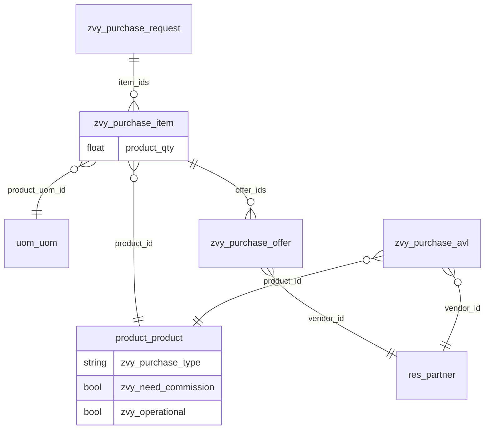

# Purchase — Architecture

Source: `Draft.md` (read-only) and `PRD.md`. This document is the technical design for `zvy_purchase`. It records **specified** structure vs **proposed** Odoo mapping. Do not treat proposed fields as requirements.

## 1. Module identity

| | |
|---|---|
| Technical name | `zvy_purchase` (addon folder already uses this) |
| Display name | Purchase (draft). Collides with core `purchase`; confirm before `__manifest__.py` |
| Category | Inventory/Purchase (proposed) |
| Location | `odoo/addons/zvy_purchase`. Custom addons in this repo usually live under `odoo/addons-mammut`. Confirm the install path. |
| Odoo version | 18 |

This module is a **new** document model. It does not extend `purchase.order`.

## 2. Specified structure

```text
Purchase Request
  └── Purchase Item[]          # each item: product + qty + UoM + Offers[]
        ├── product            # required
        ├── quantity           # required
        ├── UoM                # required, same category as product
        └── Offer[]            # each offer: vendor + price/qty/payment/delivery terms
              ├── vendor       # required, AVL for item.product
              ├── unit_price, quantity, total_price, final_price
              ├── payment_method, payment_duration
              ├── deliver_time
              └── discount_percent_per_unit

AVL
  └── vendor + product         # who may procure which product
```

## 3. Proposed Odoo models

| Draft entity | Model | Persistence |
|---|---|---|
| Purchase Request | `zvy.purchase.request` | Independent `models.Model` |
| Purchase Item | `zvy.purchase.item` | Child of request (`_name`, not `_inherits`) |
| Offer | `zvy.purchase.offer` | Child of item |
| AVL | `zvy.purchase.avl` | Vendor–product pair |
| Scale | `zvy.purchase.scale` | Company size band with purchase-rule lines |
| Purchase Rule | `zvy.purchase.scale.rule` | Threshold / approval / guarantee row per scale |
| Company | `res.company` | Existing. Scale selection + computed rule display |
| Product | `product.product` | Existing. Matches core PO lines (variant, not template). |
| Vendor | `res.partner` | Existing. Offer domain is AVL for the item’s product. |



### 3.1 `zvy.purchase.request`

Specified: owns `item_ids`. Numbered `PR-1`, `PR-2`, … on create.

| Field | Type | Notes |
|---|---|---|
| `name` | Char, readonly, copy=False | Sequence `zvy.purchase.request`, prefix `PR-`, no padding |
| `company_id` | Many2one `res.company`, required, readonly, copy=False | Set on create from the creator’s active company (`env.company`); not editable afterward |
| `currency_id` | related `company_id.currency_id` | For Monetary amounts |
| `create_uid` | Many2one `res.users` (standard) | Shown as **Creator** on form/list |
| `state` | Selection `draft` / `in_review`, default `draft`, tracking | Specified. Widget statusbar. |
| `item_ids` | One2many → `zvy.purchase.item` | `request_id`, cascade delete |
| `can_edit_items` | Boolean, computed | True when Draft, current user is `create_uid`, and user is Planner or Commercial Manager |
| `all_enquiry_items_selected` | Boolean, computed | True when ≥1 non-Tendering item and every such item is `selected` |
| `operational_amount` | Monetary, computed | Sum of Selected offer `final_price` on non-Tendering items with `product.zvy_operational` |
| `non_operational_amount` | Monetary, computed | Same for non-operational products |
| `approval_request_ids` | One2many → `approval.request` | Linked Approvals app requests |
| `approval_request_count` | Integer, computed | Len of `approval_request_ids` |
| `has_pending_approval` | Boolean, computed | Any linked approval `request_status == 'pending'` (Submitted) |
| `has_approved_approval` | Boolean, computed | Any linked approval `request_status == 'approved'` |
| `show_commission_button` | Boolean, computed | `has_approved_approval` and any matched op/non-op scale rule has `need_commission` |

`action_send()` writes `state = 'in_review'`. Allowed only from `draft` and only by the request creator (`create_uid`); otherwise `UserError` / `AccessError`. Form header **Send** button is `invisible="not can_edit_items"` (Draft + creator + Planner/CM). On Send, all purchase items are set to `submitted`; items that already have commercial experts are then promoted to `in_review`.

`action_back_to_draft()` (Commercial Manager only, `state == 'in_review'`, and not `all_enquiry_items_selected`) opens transient wizard `zvy.purchase.back.to.draft.wizard` with a mandatory `reason` Text field. Confirm writes request `state = 'draft'`, resets all items to `draft`, and `_message_log`s the reason on the request chatter. Form header **Back to Draft**: `invisible="state != 'in_review' or all_enquiry_items_selected"`.

`action_assign_expert()` (Commercial Manager only, `state == 'in_review'`, and not `all_enquiry_items_selected`) opens transient wizard `zvy.purchase.assign.expert.wizard` with one line per purchase item. Confirm writes `commercial_expert_ids` on each item (which promotes assigned items to `in_review`). Form: `invisible="state != 'in_review' or all_enquiry_items_selected"`.

`action_approval()` (Commercial Manager only, `all_enquiry_items_selected`, not `has_pending_approval`): for each of Operational / Non-Operational with a computed request type, load the company Scale rule for that category+tier; require `approval_category_id` or `UserError`. Create `approval.request` (name, category, owner, reference=PR name, amount when category has amount, link `zvy_purchase_request_id`), then `action_confirm()`. Log on PR chatter. Hidden in UI while any linked approval is Submitted (`pending`).

`action_view_approvals()` opens linked `approval.request` records (domain on `zvy_purchase_request_id`). Form smart button uses `approval_request_count`.

`action_commission()` (Commercial Manager only, `show_commission_button`): UI stub — logs “Commission requested.” on chatter and returns `True`. No calculation yet.

On `approval.request` (inherit): `zvy_purchase_request_id` Many2one; form shows the field (readonly) and a smart button `action_open_purchase_request()` that opens the linked PR.

Tier lookup: `zvy.purchase.scale._get_tier_for_amount(category, amount)` — first closed rule with `amount <= amount_max` (sorted ascending); else open-ended grand rule. Rule lookup: `_get_rule(category, tier)`.

`item_ids` is readonly when `not can_edit_items`. Item create/write/unlink also enforces creator + Draft server-side.

`mail.thread` + form `<chatter/>`. Tracked: `state`. Item/offer create, tracked writes, and unlink are also `_message_log`’d here.

### 3.2 `zvy.purchase.item`

Specified: one product, list of offers, belongs to one request. Numbered `{request.name}-PI-{n}` per request.

| Field | Type | Source |
|---|---|---|
| `name` | Char, readonly, copy=False | Specified number, e.g. `PR-1-PI-1` |
| `sequence_number` | Integer, copy=False | Per-request index `n` |
| `request_id` | Many2one `zvy.purchase.request`, required, `ondelete='cascade'` | Specified parent; readonly clickable on item form (including Commercial Expert via assigned-item rule) |
| `request_state` | related `request_id.state`, stored | For readonly UI without browsing when needed |
| `request_name` | related `request_id.name`, stored | Kept for search/display helpers |
| `request_create_uid` | related `request_id.create_uid`, stored | For `can_edit` without browsing the request |
| `state` | Selection `draft` / `submitted` / `in_review` / `selected`, default `draft`, tracking | Item workflow. Statusbar on item form; badge on lists. |
| `can_edit` | Boolean, computed | Planner/CM + Draft + creator; False for Commercial Experts |
| `can_assign_experts` | Boolean, computed | Commercial Manager (on requests they can access) |
| `can_add_offers` | Boolean, computed | CM: always True. CE: True only when `request_state` and item `state` are both `in_review`. |
| `can_submit_offers` | Boolean, computed | True when current user is in `commercial_expert_ids`, request and item are `in_review`, and at least one of their own offers (`create_uid`) is Draft or Rejected |
| `can_validate_offers` | Boolean, computed | True when current user is Commercial Manager and at least one offer on the item is `in_review` |
| `can_select_offers` | Boolean, computed | True when current user is Commercial Manager, purchase type is not Tendering, and at least one offer on the item is `validated` |
| `product_id` | Many2one `product.product`, required, tracking | Specified |
| `product_qty` | Float, required, default `1.0`, digits `Product Unit of Measure`, tracking | Specified quantity |
| `product_uom_category_id` | related `product_id.uom_id.category_id` | Domain helper for UoM |
| `product_uom_id` | Many2one `uom.uom`, required, domain same category as product, tracking | Specified UoM; defaults to `product.uom_po_id` or `product.uom_id` |
| `purchase_type_display` | Selection computed | `enquiry` → Enquiry; enquiry + need commission → Enquiry / Commission; `tendering` → Tendering. Uses product company-resolved flags. |
| `commercial_expert_ids` | Many2many `res.users`, tracking | Specified chip list; writable only by Commercial Manager |
| `offer_ids` | One2many → `zvy.purchase.offer` | Specified |
| `offer_count` | Integer, computed from `offer_ids` | Shown on the Purchase Request items list |

Item workflow transitions (system-driven; not manual buttons):

1. Create → `draft`.
2. Parent request **Send** → all items `submitted` (then any item that already has commercial experts → `in_review`).
3. Commercial Manager assigns one or more commercial experts (wizard or chip write) → that item `in_review` (only from `draft` / `submitted`; does not overwrite `selected`).
4. Selecting a Validated offer (Select wizards) → that item `selected` (also if the item already has a Selected offer).
5. Parent request **Back to Draft** → all items reset to `draft`.

`mail.thread` + form `<chatter/>`. Sequence writes use `mail_notrack`. Create/unlink and product / qty / UoM changes are also logged on `request_id`.

Create/write/unlink of item structure (product, quantity, UoM, unlink, etc.) raise `AccessError` unless the parent request is Draft and `create_uid` is the current user (and the user is Planner or Commercial Manager via ACL). After In Review, those edits are denied. Writing `state` alone (system transitions) skips the structure-edit check.

`commercial_expert_ids` may be written only by Commercial Manager (allowed even when the CM is not the request creator, including after In Review). Planners cannot assign experts. Product / quantity / UoM / structure fields stay locked after In Review.

Widget `many2many_tags`. Domain is a field lambda (not a computed Many2many): `share=False`, Commercial Expert group, `company_ids` in current company. That works on new/unsaved items; `id in allowed_*` does not until the record is reopened. No create from the chip field. Readonly when `not can_assign_experts`.

`offer_ids` UI uses `create="0"` when `not can_add_offers`. Only Commercial Expert and Commercial Manager may create offers (ACL + server check). Commercial Experts additionally require both the parent request and the item to be `in_review` (`_zvy_check_can_add_offers` on offer create).

`action_submit_offers()` (assigned Commercial Expert only) sets the current user's own Draft/Rejected offers on the item to `in_review` (same end state as per-offer Submit). Offers created by other users are not changed. Already `in_review` offers are left unchanged (no-op); locked terminal states such as `validated` are not overwritten. Requires request and item both `in_review`; otherwise `UserError` / `AccessError` if the user is not in `commercial_expert_ids`. Logs a summary on the item and request chatter ("Submitted own offers…"). Form header **Submit** is `invisible="not can_submit_offers"`.

`action_validate_offers()` (Commercial Manager only) sets all In Review offers on the item to `validated` (via `zvy_skip_offer_edit_check`, same end state as per-offer Validate). Draft, Rejected, and already Validated offers are left unchanged. `AccessError` if the user is not a Commercial Manager. Logs a summary on the item and request chatter ("Validated offers…"). Form header **Validate** sits next to **Submit**; `groups="…group_commercial_manager"` and `invisible="not can_validate_offers"`.

`action_select_offers()` (Commercial Manager only) opens transient wizard `zvy.purchase.offer.select.wizard` scoped to this item’s **Validated** offers. Confirming the chosen offer opens `zvy.purchase.offer.select.reason.wizard` with a mandatory **reason**. Confirming the reason sets the offer to `selected`, sets **all other offers on the same item** to `closed`, and sets the **purchase item** to `selected` (via `_zvy_mark_selected_if_offer_selected`). Logs on the offer, item, and request chatter include the reason and closed siblings. Form header **Select** sits next to **Validate**; `groups="…group_commercial_manager"` and `invisible="not can_select_offers"`.

On product change (onchange / create without UoM / write without UoM), `product_uom_id` is set from `product.uom_po_id` or `product.uom_id`. Quantity and UoM are readonly in views when `not can_edit` (creator + Draft + Planner/CM).

Constraint (open in PRD): unique `(request_id, product_id)` only if duplicate products on one request are forbidden.

### 3.3 `zvy.purchase.offer`

Specified: one vendor, belongs to one item. Numbered `{item.name}-OFR-{n}` per item.

| Field | Type | Source |
|---|---|---|
| `name` | Char, readonly, copy=False | Specified number, e.g. `PR-1-PI-1-OFR-1` |
| `sequence_number` | Integer, copy=False | Per-item index `n` |
| `item_id` | Many2one `zvy.purchase.item`, required, `ondelete='cascade'` | Specified parent |
| `product_id` | related `item_id.product_id` | AVL domain; shown readonly on offer form below item |
| `allowed_vendor_ids` | computed Many2many `res.partner` | AVL vendors for `product_id` |
| `vendor_id` | Many2one `res.partner`, required, domain `id in allowed_vendor_ids`, tracking | Specified |
| `currency_id` | related `item_id.company_id.currency_id` | Company currency for Monetary fields |
| `unit_price` | Monetary, tracking | Specified |
| `quantity` | Float, digits Product UoM, default from item `product_qty`, tracking | Specified; `default_get` / create / onchange from parent item |
| `total_price` | Monetary, computed readonly | `quantity * unit_price` |
| `payment_method` | Char, tracking | Free text (cash, cheque, credit, …) |
| `payment_duration` | Char, tracking | Free text (e.g. 30 days, 60 days) |
| `deliver_time` | Date, tracking | Specified delivery time |
| `discount_percent_per_unit` | Float, tracking | Decimal rate (0.1 = 10%); percentage widget |
| `final_price` | Monetary, computed readonly | `unit_price * (1 - discount_percent_per_unit) * quantity` |
| `state` | Selection `draft` / `in_review` / `validated` / `selected` / `rejected` / `closed`, default `draft`, tracking | Offer workflow. Statusbar on offer form; badge on lists. |
| `item_state` | related `item_id.state` | For Submit visibility without browsing the item |
| `request_state` | related `item_id.request_state` | For Submit visibility without browsing the request |
| `can_edit` | Boolean, computed | True when `state` in (`draft`, `rejected`) and (`create_uid` empty/new or equals current user) |
| `can_submit` | Boolean, computed | True when offer Draft or Rejected, request and item In Review, and current user is offer creator |
| `can_select_offers` | Boolean, computed | True when current user is Commercial Manager, this offer’s `state` is `validated`, and the item purchase type is not Tendering |

`mail.thread` + form `<chatter/>`. Tracked: `state` and commercial terms. Sequence writes use `mail_notrack`. Create/unlink and vendor / commercial-term changes are also logged on the item and the request.

`action_submit()` writes `state = 'in_review'`. Allowed only from `draft` or `rejected`, only by the offer creator, and only when both the parent request and item are `in_review`; otherwise `UserError` / `AccessError`. Form header **Submit** button is `invisible="not can_submit"`.

`action_validate()` (Commercial Manager only, `state == 'in_review'`) writes `state = 'validated'` (via `zvy_skip_offer_edit_check`). Form header **Validate** button has `groups="…group_commercial_manager"`, `class="oe_highlight"`, and `invisible="state != 'in_review'"`; it sits beside **Reject**.

`action_reject()` (Commercial Manager only, `state == 'in_review'`) opens transient wizard `zvy.purchase.offer.reject.wizard` with a mandatory `reason` Text field. Confirm writes offer `state = 'rejected'` (via `zvy_skip_offer_edit_check`) and `_message_log`s the reason on the offer, item, and request chatter. Form header **Reject** button has `groups="…group_commercial_manager"` and `invisible="state != 'in_review'"`.

`action_select_offers()` (Commercial Manager only) opens `zvy.purchase.offer.select.wizard` scoped to this offer’s item validated offers. Available only when **this** offer is Validated (`can_select_offers` / server check). After picking an offer, `zvy.purchase.offer.select.reason.wizard` requires a mandatory reason; confirm sets the chosen offer to `selected` and all other offers on the same item to `closed`. Form header **Select** has `groups="…group_commercial_manager"` and `invisible="not can_select_offers"`.

Write and unlink raise `AccessError` unless the offer is Draft or Rejected and the current user is the offer `create_uid` (or superuser / `zvy_skip_offer_edit_check`). In Review, Validated, Selected, and Closed offers are read-only for everyone, including the creator. Submit and Reject are not available on Validated, Selected, or Closed. Cascade delete of offers when an item is removed uses `sudo()` so parent cleanup still works. ACL still gates who may create offers; creator-only (Draft/Rejected) and locked-state checks are additional server checks on modify/delete.

Offer form: header Submit + Validate (CM, In Review) + Reject (CM, In Review) + Select (CM, when this offer is Validated) + statusbar; left group item / product / creator / vendor; right group prices (unit, qty, total, discount, final); then Payment & Delivery (method, duration, delivery time). Editable fields are `readonly="not can_edit"`. Item offers list shows name, creator (optional), vendor, unit price, quantity, total, discount, final, state (payment/delivery optional columns); row fields readonly when `not can_edit`. Statusbar simplifies by state: Validated omits Rejected; Selected shows Selected; Closed shows Closed.

**State reconciliation:** Draft.md’s Submit paragraph named the post-submit state “Submitted”, while Reject/Validate are only when the offer is “In Review”. The locked post-submit state is therefore **In Review** (not a separate Submitted). Upgrade from 1.38 migrates any `submitted` rows to `in_review`.

**Select note:** Selecting an offer sets that offer to Selected and sets **all sibling offers on the same purchase item** to Closed.

Offer vendor many2one allows create. Context passes `zvy_avl_product_id` (the item’s product) and `default_is_company`. Creating a partner in that context (or saving an offer whose vendor is not yet on AVL) calls `zvy.purchase.avl._ensure(vendor, product)`. Domain stays AVL vendors, plus the currently selected `vendor_id` so a just-created contact remains valid before the compute refreshes.

Constraint (open in PRD): unique `(item_id, vendor_id)` only if one offer per vendor per item is required.

### 3.4 `zvy.purchase.avl`

Specified: vendor–product connection. Unique `(vendor_id, product_id)`.

| Field | Type | Source |
|---|---|---|
| `vendor_id` | Many2one `res.partner`, required, `ondelete='restrict'` | Specified |
| `product_id` | Many2one `product.product`, required, `ondelete='restrict'` | Specified |

Menu: Purchase → Configuration → AVL. List + form. Offer `vendor_id` is restricted to AVL rows for the item’s product. Creating a vendor from an offer inserts the AVL row.

`zvy.purchase.avl._ensure(vendor, product)` creates the pair if missing (unique constraint).

### 3.5 Product (`product.product`)

Specified: purchase type, need commission, operational, holding-company default with per-company override, Commission Manager write-only. Menu: Purchase → Configuration → Products.

| Field | Type | Source |
|---|---|---|
| `zvy_purchase_type` | Selection `enquiry` / `tendering`, default `enquiry` | Specified. Label **Enquiry** (draft spelling “Enquery”). |
| `zvy_need_commission` | Boolean, default False | Specified **Need Commission?** |
| `zvy_operational` | Boolean, default False | Specified **Operational** |
| `zvy_purchase_type_company_values` | Json `{company_id: value}` | Storage for holding default + override |
| `zvy_need_commission_company_values` | Json `{company_id: value}` | Storage for holding default + override |
| `zvy_operational_company_values` | Json `{company_id: value}` | Storage for holding default + override |

`zvy_purchase_type`, `zvy_need_commission`, and `zvy_operational` are computed from the JSON maps. Resolve by walking `env.company` then parents up to the holding company (`parent_ids` via `sudo()` so users without `res.company` read on parents can still resolve values); the first stored key wins. Writing stores an override on the current company only. Clearing an override (value equal to the inherited value) drops the current-company key so the parent value applies again.

Native `company_dependent=True` is not used: it has no parent-company fallback, and a missing boolean cannot be distinguished from `False`.

When type is `tendering`, need commission is forced false (onchange, inverse, compute, constraint) and the field is invisible. Operational is independent of purchase type.

Write of these attributes raises `AccessError` unless the user is in `zvy_purchase.group_commission_manager` (or superuser). Views show the fields to everyone; they are readonly without that group.

### 3.6 Scale (`zvy.purchase.scale`)

Specified: company Scale (Minor / Medium / Major), dedicated Scales config screen, company Purchase Rules tab.

| Field | Type | Notes |
|---|---|---|
| `name` | Char, required, translate | Display label |
| `scale` | Selection `minor` / `medium` / `major`, unique | Matches `res.company.zvy_purchase_scale` |
| `rule_ids` | One2many → `zvy.purchase.scale.rule` | All rules |
| `operational_rule_ids` | One2many, domain `category=operational` | Same inverse; form tab |
| `non_operational_rule_ids` | One2many, domain `category=non_operational` | Same inverse; form tab |

Seeded XML data (`data/zvy_purchase_scale_data.xml`, `noupdate="1"`): three scales × two categories × four tiers = 24 rules (IRR thresholds from Mammut regulations).

`_get_tier_for_amount(category, amount)`: first closed rule with `amount <= amount_max` (by ascending `amount_max`); else open-ended rule. Used by purchase request Approval Summary types. `_get_rule(category, tier)` returns the matching rule for Approval Type lookup.

Menu: Purchase → Configuration → Scales (seq 30).

### 3.7 Scale Rule (`zvy.purchase.scale.rule`)

| Field | Type | Notes |
|---|---|---|
| `scale_id` | Many2one `zvy.purchase.scale`, cascade | Parent |
| `category` | Selection `operational` / `non_operational` | عملیاتی / غیرعملیاتی |
| `tier` | Selection `small` / `medium` / `major` / `grand` | خرد / متوسط / عمده / کلان |
| `sequence` | Integer | Display order within category |
| `amount_max` | Monetary (IRR) | Upper bound; for grand with `is_open_ended`, floor (“above X”) |
| `need_commission` | Boolean, default False | **Need Commission**; gates PR Commission button |
| `is_open_ended` | Boolean | Grand tier “above previous” |
| `currency_id` | Many2one `res.currency`, default IRR | |
| `announcement` | Text | اعلام |
| `approval_category_id` | Many2one `approval.category` | Approver / Approval Type (Approvals app) |
| `advance_guarantee` | Text | تضمین پیش پرداخت |
| `performance_guarantee` | Text | تضمین حسن انجام تعهدات |
| `required_documents` | Text | مستندات مورد نیاز |

Unique `(scale_id, category, tier)`.

### 3.8 Company (`res.company`)

| Field | Type | Notes |
|---|---|---|
| `zvy_purchase_scale` | Selection `minor` / `medium` / `major`, default `minor`, required | Scale |
| `zvy_purchase_operational_rule_ids` | Many2many computed | Rules of matching scale, operational |
| `zvy_purchase_non_operational_rule_ids` | Many2many computed | Rules of matching scale, non-operational |

Company form: Scale after `currency_id`. Page `zvy_purchase_rules` after `branches` shows Scale + readonly operational / non-operational rule lists. Request Approval Summary uses Scale thresholds via `_get_tier_for_amount` (module `1.54`).

## 4. Integrity

- Item without `request_id` or `product_id`: invalid.
- Offer without `item_id` or `vendor_id`: invalid.
- Request `name` from `ir.sequence` code `zvy.purchase.request` (`PR-` + next integer).
- Item/offer numbers are per parent (`max(sequence_number) + 1`), not global `ir.sequence`. Deleting a child does not reuse its index.
- Delete request → delete items → delete offers (`ondelete='cascade'`).
- Product and vendor are links only; deleting a product/vendor in use should be restricted (`ondelete='restrict'`), not cascade.
- Offers never point at the request directly. Request-level offer lists, if needed, are related through items.
- Offer `vendor_id` must be an AVL vendor for `item_id.product_id` (UI domain). Empty AVL for that product → empty vendor list.
- Request `state` is `draft` on create. Send may run only from `draft` → `in_review`, and only by the request creator.

## 5. Dependencies

Minimum to support the specified links:

| Addon | Why |
|---|---|
| `product` | `product.product` |
| `mail` | Chatter and field tracking on request / item / offer |
| `web` | Backend assets |
| `approvals` | `approval.category` / `approval.request` for scale Approver and PR Approval |
| `base` | `res.partner` (pulled in via `product`) |

Do **not** depend on `purchase` unless a later requirement creates RFQs/POs from offers.

`mail.activity.mixin` is not specified; chatter is for logging changes only.

## 6. Addon layout (proposed)

```text
zvy_purchase/
  __init__.py
  __manifest__.py
  models/
    __init__.py
    zvy_purchase_request.py
    zvy_purchase_avl.py
    zvy_purchase_scale.py
    product_product.py
    res_partner.py
    res_company.py
    approval_request.py
  wizard/
    __init__.py
    zvy_purchase_assign_expert_wizard.py
    zvy_purchase_assign_expert_wizard_views.xml
    zvy_purchase_back_to_draft_wizard.py
    zvy_purchase_back_to_draft_wizard_views.xml
    zvy_purchase_offer_reject_wizard.py
    zvy_purchase_offer_reject_wizard_views.xml
    zvy_purchase_offer_select_wizard.py
    zvy_purchase_offer_select_wizard_views.xml
    zvy_purchase_offer_select_reason_wizard.py
    zvy_purchase_offer_select_reason_wizard_views.xml
  views/
    zvy_purchase_request_views.xml
    zvy_purchase_avl_views.xml
    zvy_purchase_scale_views.xml
    product_product_views.xml
    res_company_views.xml
    approval_request_views.xml
  security/
    ir.model.access.csv
    zvy_purchase_security.xml
  data/
    ir_sequence_data.xml
    zvy_purchase_scale_data.xml
  PRD.md
  Architecture.md
  Draft.md                # read-only input; do not edit
```

UX mapping:

- Form for `zvy.purchase.request` with an items list (product, quantity, UoM, purchase type, commercial experts, offer count last), statusbar, Send (Draft + creator), Assign Expert and Back to Draft (In Review, CM, hidden when all Enquiry items Selected), Approval (when all Enquiry items Selected and no Submitted approval, CM — creates Approvals app requests), Commission (CM, when Approved + matched rule Need Commission — UI stub), Approval Summary amounts/types, Approvals notebook tab, Approvals smart button, and chatter.
- Inherited Approvals form: readonly Purchase Request field + smart button to open the linked PR when `zvy_purchase_request_id` is set.
- Item and offer forms include chatter.
- Each item row: product, quantity, UoM + embedded offers list (or a smart button to offers).
- Offer row: vendor, unit price, quantity, totals, discount, final price, state. Offer form shows statusbar + Submit (when eligible) + Reject (Commercial Manager, In Review), item/product/vendor, price block, and payment/delivery.
- Menu under a Purchase app root (name TBD because of the core Purchase clash).
- **Purchase Requests** menu and window action: Planner and Commercial Manager only. Menu `groups_id` is force-replaced with `(6, 0, [...])` so upgrades do not leave a stale Commercial Expert link.
- **To Review**: list of `zvy.purchase.item` with domain `commercial_expert_ids in uid`. Opens the existing item form. Create/delete not offered from this menu. Commercial Expert group only. Item form shows clickable readonly `request_id` for all roles that can open the item. Assigned CEs see a header **Submit** (`can_submit_offers`) that bulk-submits their own Draft/Rejected offers to In Review. Commercial Managers see a header **Validate** (`can_validate_offers`) that bulk-validates all In Review offers on the item, and **Select** (`can_select_offers`) that opens the Select Offer wizard for that item’s Validated offers.
- **Offers**: list of `zvy.purchase.offer` next to To Review. Visible to Commercial Expert and Commercial Manager. Action context `zvy_offers_menu` scopes the list: non-CM users to `create_uid = uid`; Commercial Managers rely on the existing company offer record rule (`item_id.request_id.company_id in company_ids`). Opens the existing offer form. Create disabled from this menu (offers are added on the item). Delete/edit follow creator-only rules on Draft/Rejected; In Review / Validated / Selected / Closed are locked. Offer form **Select** only when that offer’s status is Validated (wizard scoped to the item’s Validated offers).
- Configuration → Products: list + form of `product.product` with purchase type and need commission. Standard product form also shows the same group.
- Configuration → Scales: list + form of `zvy.purchase.scale` with Operational / Non-Operational rule tabs. Commercial Manager and Settings (`base.group_system`) may write; all internal users may read.
- Company form: Scale field; **Purchase Rules** notebook page after Branches (readonly rules for the selected scale).

Items are also reachable from **To Review** when assigned; offers are editable from the item and from the **Offers** menu.

## 7. Security

- Group `zvy_purchase.group_planner` (**Planner**). Implies `base.group_user`. Create/write/unlink on request and item. Read-only on offers. Record rule: own requests (`create_uid = user.id`) in allowed companies.
- Group `zvy_purchase.group_commercial_manager` (**Commercial Manager**). Implies `base.group_user`. Create/write/unlink on request, item, and offer. Record rule: all requests in allowed companies (any state). Only this group may write `commercial_expert_ids`. **Offers** menu lists all company offers (same company record rule as elsewhere).
- Only Planner and Commercial Manager may create purchase requests or purchase items (ACL). Adding/editing item structure (including quantity and UoM) also requires the current user to be the request `create_uid` and the request to be Draft (server-side). After In Review, item structure create/write/unlink is denied for everyone.
- Group `zvy_purchase.group_commercial_expert` (**Commercial Expert**). Implies `base.group_user`. Read/write on assigned items (write used so offer one2many create works); create/write/unlink on offers for assigned items. Read-only ACL on purchase requests limited by record rule to requests that have an item where the user is in `commercial_expert_ids` (so the item’s request many2one can open). No Purchase Requests menu. **Offers** menu lists offers they created (`create_uid`). Record rules: items/offers where the user is in `commercial_expert_ids`.
- Only Commercial Expert and Commercial Manager may create offers (ACL + `AccessError` on create for others). Commercial Experts may create offers only when both the purchase request and the purchase item are In Review.
- Only the offer **creator** may write or unlink a **Draft** or **Rejected** offer (`AccessError` otherwise), including when the other user is a Commercial Manager. Views use `can_edit` so non-creators see others’ offers readonly. **In Review**, **Validated**, **Selected**, and **Closed** offers are read-only for everyone (including the creator); write/unlink raise `AccessError`. Commercial Managers may validate In Review offers (`action_validate` with `zvy_skip_offer_edit_check`) or reject them via the Reject wizard (state write uses `zvy_skip_offer_edit_check`). Commercial Managers may also bulk-validate all In Review offers on an item via `action_validate_offers` (same lock skip). Commercial Managers may select one Validated offer via the Select wizards (`action_select_offers`; sets `selected` and siblings to `closed` with lock skip). Assigned Commercial Experts may bulk-submit their own Draft/Rejected offers on an item via `action_submit_offers` (`create_uid` must be the current user; other users’ offers are untouched).
- Group `zvy_purchase.group_commission_manager` (**Commission Manager**). Implies `base.group_user`. Written access on `product.product` so the configuration form can save the purchase attributes. Create/unlink on products stay with product managers.
- Only that group may change `zvy_purchase_type` / `zvy_need_commission` / `zvy_operational` (server-side check + readonly views).
- AVL CRUD stays with `base.group_user`.
- Scale / scale rule: read for `base.group_user`; create/write/unlink for Commercial Manager and Settings (`base.group_system`).
- Approval-sequence approvers (any `base.group_user` listed on `approval.request.approver_ids` for a linked approval): read-only ACL on purchase request, item, and offer, limited by record rules to records under that linked purchase request. No Purchase menus. Lets Approvals users open the linked PR from the Approvals form.
- Do not copy `zvy_tendering` planner / CM / commission *calculation* rules. Commission Manager only gates the product flags above.

## 8. Relation to other modules

| Module | Relation |
|---|---|
| `purchase` | Different document. No inherit, no replace. |
| `zvy_tendering` | This repo already has purchase-request / quote models. `zvy_purchase` is specified as a new module. Whether it replaces, sits beside, or stays a prototype is an open product question — not an architecture decision yet. |

Do not reuse `zvy.purchase.request` from tendering until that question is answered. This module’s models stay in the `zvy.purchase.*` namespace above.

## 9. Implementation order

1. Manifest, security, empty models with the specified fields only.
2. Request form: items with `product_id`.
3. Item offers with `vendor_id`.
4. Sequence + list/search views + menu.
5. Hierarchical names: `PR-n`, `PR-n-PI-m`, `PR-n-PI-m-OFR-k`.
6. AVL under Configuration; offer vendor domain from AVL.
7. Product purchase type / need commission; Configuration → Products; Commission Manager group.
8. Request state Draft / In Review and Send button.
9. Chatter on request, item, and offer; child changes also logged on the request.
10. Create vendor from offer → contact + AVL for the item product.
11. Commercial Expert group + item chip list (current-company members of that group).
12. To Review menu: items where current user is in `commercial_expert_ids`.
13. Planner and Commercial Manager groups; request `company_id`; record rules (own vs company); creator-only item edits; lock items after In Review.
14. Offer create limited to Commercial Expert + Commercial Manager; commercial-expert chips writable only by Commercial Manager.
15. Assign Expert wizard on In Review requests (Commercial Manager).
16. Quantity and UoM on purchase items (creator-only edit while Draft).
17. Back to Draft wizard with mandatory reason logged in chatter (Commercial Manager, In Review).
18. Purchase item workflow: Draft → Submitted (on request Send) → In Review (when commercial experts assigned) → Selected (when an offer is Selected); Back to Draft resets items to Draft.
19. Offer commercial terms: unit price, quantity (default from item), total/final price, payment method/duration, delivery time, discount rate.
20. Offer edit/delete limited to the offer creator (Draft or Rejected).
21. Offers menu (CE: own offers; CM: company offers).
22. Offer workflow: Draft (or Rejected) → In Review (creator Submit when request and item are In Review); In Review is read-only; Commercial Manager Validate → Validated (read-only, no Submit/Reject); Commercial Manager Reject → Rejected (mandatory reason wizard, chatter log); Rejected reuses Draft edit/submit rules.
23. Purchase item **Submit** (assigned CE): bulk own Draft/Rejected offers → In Review; skips other users’ offers and `in_review` / `validated`; AccessError if not assigned; chatter log.
24. Purchase item **Validate** (Commercial Manager): bulk all In Review offers → Validated (same as per-offer Validate / `zvy_skip_offer_edit_check`); leaves draft/rejected/validated unchanged; AccessError if not CM; chatter log.
25. Offer **Select** (Commercial Manager, Enquiry only — not Tendering): when ≥1 Validated offer on an item, **Select** on the item form; on the offer form only when that offer is Validated. Pick a Validated offer, then enter a mandatory selection reason → offer Selected (locked); siblings → Closed; **purchase item → Selected**; ACL CM-only; chatter logs the reason and closed siblings. Migration `1.51` backfills item Selected from existing Selected offers.
26. Company Scale + Scales config + company Purchase Rules tab (module `1.52`).
27. Product **Operational** flag (company-dependent, Commission Manager write-only; module `1.53`).
28. PR Approval Summary (module `1.54` / `1.55`): when all Enquiry items are Selected — hide Assign Expert and Back to Draft; Operational/Non-Operational amounts and types from Selected offer final prices and company Scale thresholds.
29. Scale Approver → `approval.category`; Approval button creates/confirms `approval.request` per applicable category; Approvals list on PR (module `1.56`). Depends on `approvals`.
30. Bidirectional Approval ↔ PR UI (module `1.57`): Approvals form shows linked Purchase Request + smart button; PR form Approvals smart button opens linked approvals.
31. Approval-sequence approvers get read-only access to linked purchase requests, items, and offers (module `1.58`).
32. Scale rule **Need Commission**; Approval hidden while Submitted; Commission UI stub when Approved + need commission (module `1.59`).
33. Stop. Add further states, approvals outcome → PR state, commission calculation, or PO integration only after `PRD.md` is updated.

## 10. Open technical decisions

1. Confirm display name vs core Purchase.
2. Confirm addon path (`odoo/addons` vs `odoo/addons-mammut`).
3. `product.product` vs `product.template`.
4. Unique product per request; unique vendor per item.
5. Whether attachments or activities (not just change logs) are needed on chatter.
6. Whether purchase type / need commission should live on `product.template` (shared by variants) instead of `product.product`.
